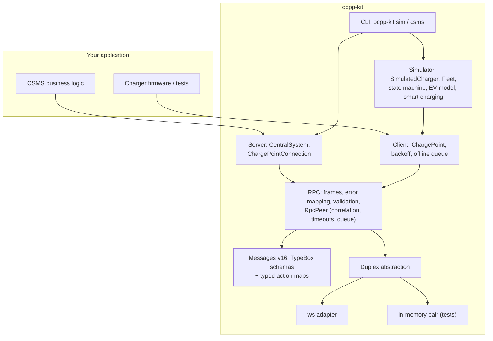
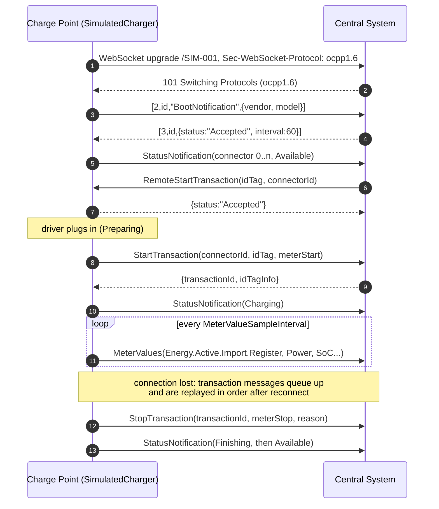

# ocpp-kit

[](https://github.com/houssammehdi/ocpp-kit/actions/workflows/ci.yml)
[](LICENSE)
[](package.json)

**A type-safe OCPP 1.6-J toolkit for Node.js.** ocpp-kit gives you the pieces to build and test
EV-charging back ends: a transport-agnostic RPC layer that implements the OCPP-J framing rules
(strict frame validation, error-code mapping, message correlation, timeouts, and the "one
outstanding CALL" rule), a typed message catalogue where `call('BootNotification', ...)` is
checked end to end at compile time and validated at run time, a Central System (CSMS) server, a
resilient Charge Point client, and a realistic charge-point simulator with a CLI that can put
hundreds of chargers on a CSMS from one laptop. All schemas were written by hand from the public
OCPP 1.6 specification.

```ts
const response = await chargePoint.call('BootNotification', {
  chargePointVendor: 'Acme',
  chargePointModel: 'Wallbox 22',
});
response.status; // 'Accepted' | 'Pending' | 'Rejected'
```

## Contents

- [Features](#features)
- [OCPP in 60 seconds](#ocpp-in-60-seconds)
- [Quickstart](#quickstart)
- [Architecture](#architecture)
- [Usage](#usage)
- [Simulator and CLI](#simulator-and-cli)
- [Design notes](#design-notes)
- [Spec coverage](#spec-coverage)
- [Testing](#testing)
- [Limitations](#limitations)
- [Project layout](#project-layout)

## Features

- **RPC layer** (`src/rpc`): parses and serializes `CALL`, `CALLRESULT` and `CALLERROR` frames.
  Malformed input maps to the OCPP-J error codes (`FormationViolation`, `ProtocolError`,
  `NotImplemented`, `NotSupported`, `TypeConstraintViolation`, `PropertyConstraintViolation`,
  `OccurenceConstraintViolation`, and so on). It correlates responses by message id, applies a
  timeout to each call, queues outgoing calls FIFO so only one is outstanding at a time, keeps a
  registry of typed handlers, and validates payloads on inbound requests and outbound responses.
  It runs over any `Duplex`, so unit tests need no sockets.
- **Message catalogue** (`src/messages/v16`): TypeBox schemas for every Core-profile message in
  both directions, plus TriggerMessage, SetChargingProfile, ClearChargingProfile and
  GetCompositeSchedule. The same objects give you runtime validators and static types.
- **Central System** (`src/server`): a `ws`-based server that negotiates the `ocpp1.6`
  subprotocol, takes the identity from the URL path, and supports a Basic-auth hook (Security
  Profile 1). It keeps a connection registry with a policy for duplicate identities, emits
  typed events, checks liveness with pings, and shuts down gracefully.
- **Charge Point client** (`src/client`): reconnects automatically using exponential backoff with
  full jitter. StartTransaction, StopTransaction and MeterValues go through a persistent offline
  queue, are replayed in order after a reconnect, and are retried a bounded number of times.
- **Simulator** (`src/simulator`): a virtual charger with the OCPP connector state machine, a
  CC/CV charging curve, an energy register, a configuration store with read-only keys, smart
  charging (stacking, recurring schedules, composite schedules, fair sharing of the station
  limit) and a seeded "autopilot" that makes virtual drivers arrive, charge and leave.
- **CLI**: `ocpp-kit sim` load-tests a CSMS with N chargers at a given ramp rate.
  `ocpp-kit csms` runs a demo Central System with a live table and interactive remote control.

## OCPP in 60 seconds

The Open Charge Point Protocol (OCPP) is how a charging station ("Charge Point") talks to its
management back end ("Central System", often called CSMS). In OCPP 1.6-J, each charge point
opens one WebSocket to `wss://csms.example.com/ocpp/<chargePointId>` with the subprotocol
`ocpp1.6`. Both sides then exchange JSON arrays:

```text
[2, "<messageId>", "<Action>", {payload}]                              CALL
[3, "<messageId>", {payload}]                                          CALLRESULT
[4, "<messageId>", "<errorCode>", "<errorDescription>", {errorDetails}] CALLERROR
```

The charge point sends `BootNotification`, `StatusNotification`, `Heartbeat`, `Authorize`,
`StartTransaction`, `MeterValues` and `StopTransaction`. The Central System sends commands such
as `RemoteStartTransaction`, `Reset`, `ChangeConfiguration` or `SetChargingProfile`. Either side
may have at most one CALL waiting for an answer at any time.

## Quickstart

Requirements: Node.js 20 or newer. The package is not yet published to npm, so install it from
source:

```bash
git clone https://github.com/houssammehdi/ocpp-kit.git
cd ocpp-kit
npm ci
npm run build

# Terminal 1: a demo Central System with a live table
node dist/cli/main.js csms --port 9220

# Terminal 2: 50 simulated charge points, started 5 per second
node dist/cli/main.js sim --url ws://localhost:9220 --count 50 --ramp 5/s
```

Run `npm link` if you want the `ocpp-kit` command on your `PATH`. The runnable examples in
[`examples/`](examples) use `tsx`:

```bash
npm run example:csms            # Central System on :9220 (Ctrl-C to stop)
npm run example:charge-point    # one session against it
npm run example:smart-charging  # self-contained: charging profiles in action
```

## Architecture



The RPC core only sees a `Duplex` (`send`, `close` and one receiver). The server and client plug
in a `ws` adapter, and unit tests plug in an in-memory pair. That keeps the queueing, timeout
and error-mapping logic easy to test deterministically with fake timers.

A typical session, as the simulator and the demo CSMS play it:



## Usage

### Central System

```ts
import { CentralSystem } from 'ocpp-kit';

const cs = new CentralSystem({
  basePath: '/ocpp', // ws://host:9220/ocpp/<identity>
  authenticate: ({ identity, password }) => lookupKey(identity) === password, // Security Profile 1
  requireAcceptedBoot: true, // SecurityError for anything before an accepted BootNotification
});

cs.handle('BootNotification', (req, { connection }) => {
  console.log(connection.identity, req.chargePointVendor); // req is fully typed
  return { status: 'Accepted', currentTime: new Date().toISOString(), interval: 300 };
});
cs.handle('StartTransaction', async ({ idTag, connectorId, meterStart }) => ({
  idTagInfo: { status: 'Accepted' },
  transactionId: await db.startSession(idTag, connectorId, meterStart),
}));

cs.on('connect', (cp) => console.log(`${cp.identity} online`));
cs.on('call', ({ connection, action, durationMs, error }) =>
  metrics.observe(connection.identity, action, durationMs, error),
);

await cs.listen(9220);

// Calls towards a charge point are typed request -> response too.
const { status } = await cs.call('CP-001', 'RemoteStartTransaction', { idTag: '04A2B3C4' });
await cs.close(); // closes every connection with 1001, then the HTTP server
```

`cs.attach(httpsServer)` attaches to an existing HTTP or HTTPS server instead of creating one.

### Charge Point

```ts
import { ChargePoint, FileQueueStore } from 'ocpp-kit';

const cp = new ChargePoint({
  identity: 'CP-001',
  url: 'wss://csms.example.com/ocpp',
  password: process.env.AUTH_KEY,
  reconnect: { initialDelayMs: 1_000, maxDelayMs: 60_000 }, // full jitter by default
  offlineQueue: { store: new FileQueueStore('/var/lib/cp/queue.json') }, // survives restarts
});

cp.handle('Reset', ({ type }) => ({ status: type === 'Soft' ? 'Accepted' : 'Rejected' }));
cp.on('reconnecting', (attempt, delayMs) => log(`reconnect #${attempt} in ${delayMs} ms`));

await cp.connect();
await cp.call('BootNotification', { chargePointVendor: 'Acme', chargePointModel: 'W22' });

// Resolves when the Central System has accepted it, even if the link drops meanwhile.
const { transactionId } = await cp.call('StartTransaction', {
  connectorId: 1,
  idTag: '04A2B3C4',
  meterStart: 0,
  timestamp: new Date().toISOString(),
});
```

### The RPC layer on its own

```ts
import {
  CentralSystemToChargePoint,
  ChargePointToCentralSystem,
  createDuplexPair,
  RpcPeer,
} from 'ocpp-kit';

const [a, b] = createDuplexPair(); // or webSocketDuplex(ws)
const csms = new RpcPeer(b, {
  inbound: ChargePointToCentralSystem,
  outbound: CentralSystemToChargePoint,
});
const station = new RpcPeer(a, {
  inbound: CentralSystemToChargePoint,
  outbound: ChargePointToCentralSystem,
  callTimeoutMs: 10_000,
});

csms.handle('Heartbeat', () => ({ currentTime: new Date().toISOString() }));
await station.call('Heartbeat', {});
```

How the RPC layer maps faults to CALLERROR codes:

| Situation                                                          | Code                                                       |
| ------------------------------------------------------------------ | ---------------------------------------------------------- |
| Not JSON, not an array, wrong element types, message id > 36 chars | `FormationViolation` (reply only if the id is recoverable) |
| Unknown message type id, too few elements                          | `ProtocolError`                                            |
| Too many elements, undeclared payload property                     | `FormationViolation`                                       |
| Action not in the catalogue                                        | `NotImplemented`                                           |
| Known action without a registered handler                          | `NotSupported`                                             |
| Required field missing, array too short                            | `OccurenceConstraintViolation`                             |
| Wrong JSON type (e.g. `"1"` for an integer)                        | `TypeConstraintViolation`                                  |
| Right type, invalid value (enum, length, range, date-time)         | `PropertyConstraintViolation`                              |
| Handler threw a non-`RpcError`, or produced an invalid response    | `InternalError`                                            |
| Handler threw `new RpcError(code, ...)`                            | that code                                                  |

## Simulator and CLI

### `ocpp-kit sim`

```bash
ocpp-kit sim --url ws://localhost:9220 --count 50 --ramp 5/s \
  --connectors 2 --max-power 22 --meter-interval 60s --idle 30s-5m --seed 42
```

Each simulated charger:

- boots, retries while `Pending` or `Rejected`, applies the heartbeat interval it is given, and
  reports every connector;
- runs one state machine per connector (Available, Preparing, Charging, SuspendedEV,
  SuspendedEVSE, Finishing, Faulted, Unavailable) using the transition table from the
  specification;
- models an EV battery. Power is constant up to about 80 % SoC and then tapers (CV phase), with
  charging losses. The energy register is integrated on a fixed tick, so a given seed always
  produces the same values;
- serves RemoteStart/Stop (honouring `AuthorizeRemoteTxRequests` and `ConnectionTimeOut`),
  Reset (it stops its transactions, reboots and boots again), ChangeAvailability (including
  `Scheduled`), Get/ChangeConfiguration (read-only keys, validated values), UnlockConnector,
  TriggerMessage, ClearCache and DataTransfer;
- applies SetChargingProfile/ClearChargingProfile. TxProfile beats TxDefaultProfile, which beats
  a connector-0 default, and the highest stack level wins. It supports Absolute, Relative and
  Daily/Weekly Recurring schedules, answers GetCompositeSchedule, and splits a
  ChargePointMaxProfile across connectors with max-min fairness;
- with the autopilot on (the default for the CLI), lets seeded virtual drivers arrive, swipe a
  card, charge until full or until they leave, and unplug.

It prints a live status line. `--duration 10m --json` makes it stop by itself and print the
final statistics as JSON, which is handy in CI pipelines of a CSMS.

A sample run on the machine this project was developed on (4 vCPU container, Node 22, CSMS and
simulator as two processes on the same host), reproducible with:

```bash
node dist/cli/main.js csms --port 9221 --no-table &
node dist/cli/main.js sim --url ws://localhost:9221 --count 500 --ramp 100/s \
  --meter-interval 10s --idle 5s-30s --duration 60s
```

```text
Final: t=00:01:00 started 500/500 online 500 booted 500 | tx 1000 (done 0) | 12967.4 kW 133.6 kWh | calls 9242 err 0 | rtt p50 0.4 p95 0.7 p99 1.5 ms
```

The round-trip times are measured on loopback, so they show the toolkit's own overhead and not
what a real network adds.

### `ocpp-kit csms`

```bash
ocpp-kit csms --port 9220 --heartbeat 60s --auto-start 30s
```

A demo Central System. It accepts every charge point and every id tag, and hands out
transaction ids. On a terminal it redraws a compact table of charge points, connector states,
power, energy and message counts every second, and accepts commands:

```text
start <id> [connector] [idTag]   stop <id> [connector|txId]   limit <id> <kW|off>
reset <id> [hard]                list                         help   quit
```

`--auto-start` remote-starts one idle connector on every connected charger at each interval.
`--password` enables Basic auth, and `--no-table` switches to plain log lines, which also
happens automatically when stdout is not a TTY.

### Programmatic use

```ts
import { Fleet, SimulatedCharger } from 'ocpp-kit';

const charger = new SimulatedCharger({
  identity: 'SIM-1',
  url: 'ws://localhost:9220',
  connectors: 2,
});
await charger.start();
charger.plugIn(1, { batteryKWh: 77, initialSoc: 0.2, targetSoc: 0.9, maxPowerW: 11_000 });
await charger.swipe(1, '04A2B3C4');
charger.connectors[0]; // { status: 'Charging', powerW: 11000, energyWh: ..., soc: ... }

const fleet = new Fleet({
  url: 'ws://localhost:9220',
  count: 200,
  ratePerSecond: 20,
  seed: 7,
  charger: { autopilot: true },
});
await fleet.start();
fleet.stats(); // connected, active transactions, kW, kWh, call latency p50/p95/p99, ...
```

## Design notes

**One outstanding CALL per direction, enforced by a queue.** OCPP-J forbids sending a new CALL
before the previous one is answered or has timed out. Many chargers rely on this and handle
only one request at a time. `RpcPeer.call()` therefore never writes to the socket directly. It
appends to a FIFO queue and sends the next frame only once the current one settles. The timeout
starts when a frame is sent, not when it is queued, so a burst of calls cannot time out while
waiting its turn. Inbound CALLs are served independently, so the two directions never block
each other. A late answer to a call that has already timed out is reported as
`unmatchedResponse` and otherwise ignored.

**Validation in both directions.** Inbound requests are validated before a handler runs, so
handlers only ever see well-typed data, and faults get the error code whose definition matches.
Outbound requests are validated before they are sent: a bug in your code rejects locally with
`remote: false` instead of reaching a charger and getting a confusing CALLERROR back. Your
handlers' responses are validated too, and an invalid one becomes an `InternalError` rather
than a malformed frame. Validators are compiled once per schema with TypeBox's JIT compiler.
When several constraints fail at once, the most structural one wins
(Formation > Occurence > Type > Property), which keeps the reported code deterministic.

**Backoff with full jitter.** After a CSMS outage, thousands of chargers reconnect at the same
moment. Plain exponential backoff keeps them in lockstep. With full jitter
(`random(0, min(max, base * 2^n))`) the reconnects spread out across each window. The backoff
counter resets only after a connection has been up for `resetAfterMs`, so a server that accepts
connections and drops them immediately is not hammered at the minimum delay.

**At-least-once, ordered transaction messages.** StartTransaction, StopTransaction and
MeterValues are persisted before they are sent. They are delivered strictly in order and
removed only once the Central System has answered. If the connection is lost mid-flight, the
message is sent again after reconnecting, so a CSMS should treat these messages idempotently.
CALLERROR responses and timeouts use up to `transactionMessageAttempts` attempts, mirroring
`TransactionMessageAttempts` and `TransactionMessageRetryInterval`. When the queue is full, the
oldest MeterValues is evicted first. Start and stop messages are never evicted.

**Registration survives reconnects.** With `requireAcceptedBoot`, the server remembers accepted
BootNotifications per identity, not per socket. In OCPP 1.6 a charger reconnecting after a
network blip does not boot again, and its replayed transaction messages must not be refused.

**Determinism.** The simulator draws every random decision (EV battery size, SoC, arrival and
dwell times, id tags) from a per-charger PRNG derived from `--seed` and the identity. It
integrates energy on a fixed tick, and reconnect jitter uses a separate stream so that network
timing cannot shift the scenario. Under fake timers, two runs with the same seed produce the
same message log, and the tests check this.

**Clean-room schemas.** The JSON schemas were written from the specification text, not copied
from the official schema files. The official schemas' `multipleOf: 0.1` on decimal fields is
deliberately left out, because floating-point values such as `0.3` would fail it.

## Spec coverage

Implemented means: typed schema in the catalogue, runtime validation, handler support in
`CentralSystem` / `ChargePoint`, and behaviour in the simulator.

| Profile         | Message                                             | Direction | Catalogue | Simulator behaviour                                                             |
| --------------- | --------------------------------------------------- | --------- | :-------: | ------------------------------------------------------------------------------- |
| Core            | Authorize                                           | CP → CS   |    yes    | before local starts, online or offline (`LocalAuthorizeOffline`)                |
| Core            | BootNotification                                    | CP → CS   |    yes    | Pending/Rejected retry, heartbeat interval                                      |
| Core            | DataTransfer                                        | both      |    yes    | answers `UnknownVendorId`                                                       |
| Core            | Heartbeat                                           | CP → CS   |    yes    | `HeartbeatInterval`, restarts on change                                         |
| Core            | MeterValues                                         | CP → CS   |    yes    | periodic samples per `MeterValuesSampledData`, offline queue                    |
| Core            | StartTransaction / StopTransaction                  | CP → CS   |    yes    | with `transactionData`, stop reasons, offline queue                             |
| Core            | StatusNotification                                  | CP → CS   |    yes    | on every transition, connector 0 included                                       |
| Core            | ChangeAvailability                                  | CS → CP   |    yes    | Accepted / Scheduled / Rejected                                                 |
| Core            | ChangeConfiguration / GetConfiguration              | CS → CP   |    yes    | 24 standard keys, read-only flags, value validation, `RebootRequired`           |
| Core            | ClearCache                                          | CS → CP   |    yes    | Accepted                                                                        |
| Core            | RemoteStartTransaction / RemoteStopTransaction      | CS → CP   |    yes    | TxProfile, `AuthorizeRemoteTxRequests`, `ConnectionTimeOut`                     |
| Core            | Reset                                               | CS → CP   |    yes    | stops transactions, reboots, boots again                                        |
| Core            | UnlockConnector                                     | CS → CP   |    yes    | ends the transaction (`UnlockCommand`)                                          |
| Remote Trigger  | TriggerMessage                                      | CS → CP   |    yes    | Boot, Heartbeat, Status, MeterValues; `NotImplemented` for firmware/diagnostics |
| Smart Charging  | SetChargingProfile                                  | CS → CP   |    yes    | stacking, purposes, all kinds, limits enforced                                  |
| Smart Charging  | ClearChargingProfile                                | CS → CP   |    yes    | by id or by criteria                                                            |
| Smart Charging  | GetCompositeSchedule                                | CS → CP   |    yes    | merged schedule incl. hardware limit, A or W                                    |
| Firmware Mgmt   | UpdateFirmware, GetDiagnostics, *StatusNotification | -         |    no     | -                                                                               |
| Local Auth List | SendLocalList, GetLocalListVersion                  | -         |    no     | -                                                                               |
| Reservation     | ReserveNow, CancelReservation                       | -         |    no     | -                                                                               |

## Testing

```bash
npm test              # 250+ unit and integration tests (vitest)
npm run test:coverage # with a v8 coverage report
npm run lint && npm run typecheck && npm run format:check && npm run build
```

What the tests cover:

- **Framing**: every frame type, arity errors, bad ids (including the 36-character limit), type
  errors, and unknown CALLERROR codes.
- **Error mapping**: each validation fault class, priority between faults, and nested charging
  profiles.
- **RpcPeer**: correlation, the one-outstanding-CALL queue, timeouts under fake timers (the
  clock starts at send time; late answers are ignored), aborts, close semantics, and validation
  in both directions.
- **Client**: backoff and jitter maths; reconnect cycles under fake timers, including backoff
  that resets only after a stable connection; ordered replay; retry and drop; replay by a new
  client instance from a persisted store; the atomic file store.
- **Simulator**: every state-machine transition (allowed and rejected), the CC/CV curve,
  configuration rules, profile stacking, recurring and composite schedules, fair sharing, every
  Central System command, outages, and seed determinism.
- **Integration over real WebSockets on an ephemeral port**: subprotocol negotiation, Basic
  auth, duplicate identities, ping timeouts, graceful shutdown; 20 concurrent charge points
  going through boot, authorize, start, meter values and stop; 20 simulated chargers driven by
  remote start and stop; a network outage with refused reconnects and ordered replay;
  wire-level CALLERROR codes; and one outstanding CALL on the wire.
- **CLI**: argument parsing, table rendering, and `runCsms` plus `runSim` against each other in
  process.

## Limitations

- **OCPP 1.6-J only.** OCPP 2.0.1 is not implemented yet. The RPC core and the `Duplex`
  abstraction are version-agnostic, so 2.0.1 would mostly need a new catalogue.
- **No built-in TLS for Security Profiles 2 and 3.** The client accepts `wss://` URLs, and the
  server can be attached to your own `https.Server` (`cs.attach(server)`), but certificate
  management, client certificates and the 1.6 security extension messages are not included.
- Firmware Management, Local Auth List Management and Reservation profiles are not implemented,
  and the simulator does not model reservations (the `Reserved` state).
- The offline queue gives at-least-once delivery. A Central System has to de-duplicate a
  message that is sent again after a connection dropped mid-flight.
- `requireAcceptedBoot` keeps registrations in memory, so a restarted server forgets them.
- The simulator integrates energy on a fixed tick. If the event loop is saturated, simulated
  time runs slower than wall-clock time, although meter values remain internally consistent.
- Some standard configuration keys are exposed and validated but do not change the simulator's
  behaviour yet (for example the clock-aligned data keys and `StopTransactionOnEVSideDisconnect`,
  which is always treated as `true`).
- The demo CSMS is meant for testing and demos: it authorizes everything and keeps its state
  in memory.

## Project layout

```text
src/
  rpc/          frames, error codes, validation, Duplex, RpcPeer
  messages/v16/ hand-written schemas: primitives, datatypes, core, smart charging, catalogue
  transport/    ws adapter
  server/       CentralSystem, ChargePointConnection, Basic auth
  client/       ChargePoint, backoff, offline queue + stores, connector
  simulator/    charger, connector state machine, EV model, configuration,
                smart charging, fleet, latency stats, seeded PRNG
  cli/          ocpp-kit sim / csms, demo CSMS, argument parsing, table rendering
examples/       runnable examples (tsx)
test/           unit and integration tests (vitest)
```

## License

[MIT](LICENSE) © 2026 Houssam Mehdi
