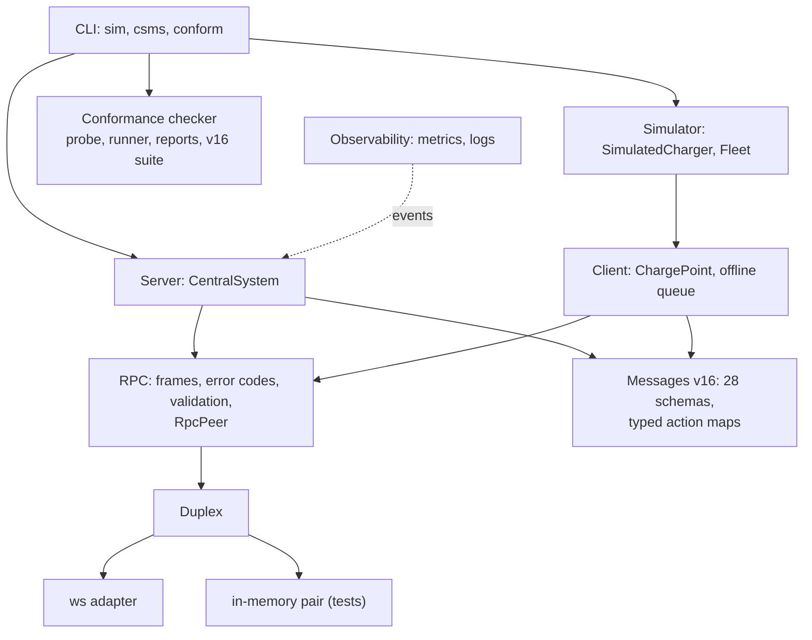
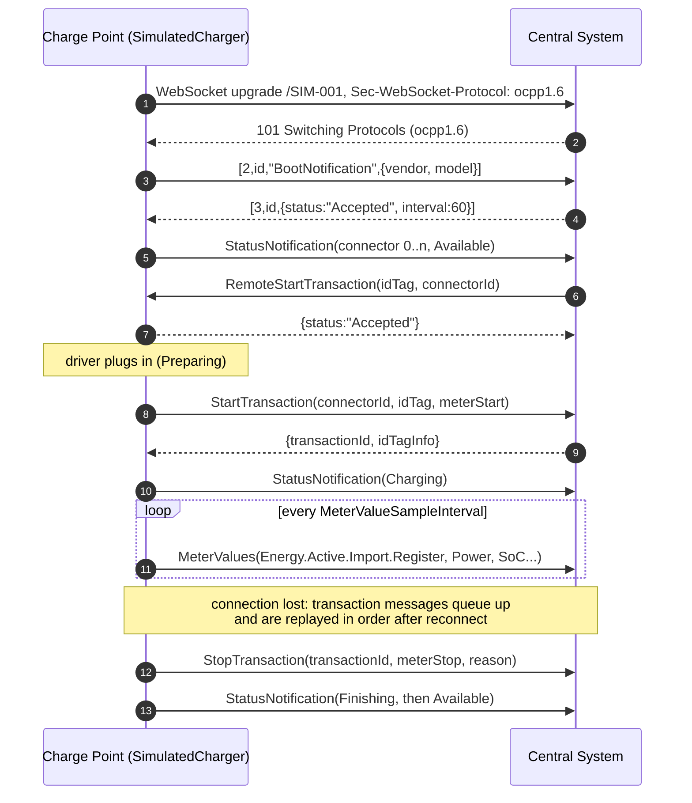

# ocpp-kit

[](https://github.com/houssammehdi/ocpp-kit/actions/workflows/ci.yml)
[](LICENSE)
[](package.json)

**A type-safe OCPP 1.6-J toolkit for Node.js.** ocpp-kit gives you the pieces to build and test
EV-charging back ends: an RPC layer that implements the OCPP-J framing rules, a typed catalogue of
all 28 OCPP 1.6 messages (checked at compile time and validated at run time), a Central System
server and a Charge Point client with TLS and client certificates (Security Profiles 1 to 3), a
charge-point simulator that implements all six feature profiles, a conformance checker for
Central Systems, and Prometheus metrics. All schemas were
written by hand from the public OCPP 1.6 specification.

```ts
const response = await chargePoint.call('BootNotification', {
  chargePointVendor: 'Acme',
  chargePointModel: 'Wallbox 22',
});
response.status; // 'Accepted' | 'Pending' | 'Rejected'
```

## Contents

- [Features](#features)
- [OCPP in 60 seconds](#ocpp-in-60-seconds)
- [Quickstart](#quickstart)
- [Architecture](#architecture)
- [Usage](#usage)
- [Simulator and CLI](#simulator-and-cli)
- [Conformance checker](#conformance-checker)
- [Observability](#observability)
- [Performance](#performance)
- [Design notes](#design-notes)
- [Spec coverage](#spec-coverage)
- [Testing](#testing)
- [Limitations](#limitations)
- [Project layout](#project-layout)

More in [`docs/`](docs): [architecture](docs/architecture.md),
[conformance checks](docs/conformance.md) and [OCPP 1.6 field notes](docs/ocpp16-field-notes.md).
`npm run docs` builds the API reference with TypeDoc.

## Features

- **RPC layer** (`src/rpc`): parses and serializes `CALL`, `CALLRESULT` and `CALLERROR` frames,
  maps malformed input to the OCPP-J error codes, correlates responses by message id, applies a
  timeout to each call, queues outgoing calls FIFO so only one is outstanding at a time, and
  validates payloads in both directions. It runs over any `Duplex`, so unit tests need no
  sockets, and it is fuzzed with property-based tests.
- **Message catalogue** (`src/messages/v16`): TypeBox schemas for all 28 OCPP 1.6 messages of
  the six feature profiles, with the feature profile of every action. The same objects give you
  runtime validators and static types.
- **Central System** (`src/server`): negotiates `ocpp1.6`, takes the identity from the URL
  path, serves `ws://` or `wss://`, checks Basic auth (Security Profiles 1 and 2) and client
  certificates with a configurable identity binding (Profile 3), keeps a connection registry
  with a policy for duplicate identities, emits typed events, checks liveness with pings and
  shuts down gracefully.
- **Charge Point client** (`src/client`): reconnects with exponential backoff and full jitter,
  pins CAs or certificate fingerprints, presents client certificates, and puts StartTransaction,
  MeterValues and StopTransaction through a persistent offline queue that replays them in order
  after an accepted BootNotification, even for transactions started while offline.
- **Simulator** (`src/simulator`): a virtual charger that implements all six profiles: the
  connector state machine (Reserved included), sampled and clock-aligned metering, the
  Authorization Cache and Local Authorization List with the offline rules, reservations,
  simulated firmware updates and diagnostics uploads with retries and failure injection, smart
  charging, TriggerMessage for every message, and a seeded autopilot of drivers.
- **Conformance checker** (`src/conformance`, `ocpp-kit conform`): 31 checks of a Central
  System, each with a specification reference and a MUST/SHOULD level, as text, JSON or JUnit.
- **Observability** (`src/observability`): Prometheus metrics (connections, calls by action and
  result, latency histograms, errors) and structured logs for a Central System.
- **CLI**: `ocpp-kit sim` load-tests a CSMS with N chargers, `ocpp-kit csms` runs a demo Central
  System with a live table, remote control, metrics and JSON logs, and `ocpp-kit conform` checks
  a CSMS.

## OCPP in 60 seconds

The Open Charge Point Protocol (OCPP) is how a charging station ("Charge Point") talks to its
management back end ("Central System", often called CSMS). In OCPP 1.6-J, each charge point
opens one WebSocket to `wss://csms.example.com/ocpp/<chargePointId>` with the subprotocol
`ocpp1.6`. Both sides then exchange JSON arrays:

```text
[2, "<messageId>", "<Action>", {payload}]                              CALL
[3, "<messageId>", {payload}]                                          CALLRESULT
[4, "<messageId>", "<errorCode>", "<errorDescription>", {errorDetails}] CALLERROR
```

The charge point sends `BootNotification`, `StatusNotification`, `Heartbeat`, `Authorize`,
`StartTransaction`, `MeterValues` and `StopTransaction`. The Central System sends commands such
as `RemoteStartTransaction`, `Reset`, `ChangeConfiguration` or `SetChargingProfile`. Neither side
should send a new CALL while its previous one is unanswered (OCPP-J 1.6 §4.1.1).

## Quickstart

Requirements: Node.js 20 or newer. The package is not yet published to npm, so install it from
source:

```bash
git clone https://github.com/houssammehdi/ocpp-kit.git
cd ocpp-kit
npm ci
npm run build

# Terminal 1: a demo Central System with a live table
node dist/cli/main.js csms --port 9220

# Terminal 2: 50 simulated charge points, started 5 per second
node dist/cli/main.js sim --url ws://localhost:9220 --count 50 --ramp 5/s

# Or check the demo CSMS against the specification
node dist/cli/main.js conform --url ws://localhost:9220 --identity CP001
```

Run `npm link` if you want the `ocpp-kit` command on your `PATH`. The runnable examples in
[`examples/`](examples) use `tsx`:

```bash
npm run example:csms            # Central System on :9220 (Ctrl-C to stop)
npm run example:charge-point    # one session against it
npm run example:smart-charging  # self-contained: charging profiles in action
```

## Architecture



The RPC core only sees a `Duplex` (`send`, `close` and one receiver) and two action catalogues,
so nothing in it is specific to OCPP 1.6. The server and client plug in a `ws` adapter, and unit
tests plug in an in-memory pair, which keeps the queueing, timeout and error-mapping logic easy
to test deterministically with fake timers. [docs/architecture.md](docs/architecture.md) has the
details, including where OCPP 2.0.1 would plug in.

A typical session, as the simulator and the demo CSMS play it:



## Usage

### Central System

```ts
import { CentralSystem } from 'ocpp-kit';

const cs = new CentralSystem({
  basePath: '/ocpp', // ws://host:9220/ocpp/<identity>
  authenticate: ({ identity, password }) => lookupKey(identity) === password, // Security Profile 1
  requireAcceptedBoot: true, // SecurityError for anything before an accepted BootNotification
});

cs.handle('BootNotification', (req, { connection }) => {
  console.log(connection.identity, req.chargePointVendor); // req is fully typed
  return { status: 'Accepted', currentTime: new Date().toISOString(), interval: 300 };
});
cs.handle('StartTransaction', async ({ idTag, connectorId, meterStart }) => ({
  idTagInfo: { status: 'Accepted' },
  transactionId: await db.startSession(idTag, connectorId, meterStart),
}));

cs.on('connect', (cp) => console.log(`${cp.identity} online`));
cs.on('call', ({ connection, action, durationMs, error }) =>
  metrics.observe(connection.identity, action, durationMs, error),
);

await cs.listen(9220);

// Calls towards a charge point are typed request -> response too.
const { status } = await cs.call('CP-001', 'RemoteStartTransaction', { idTag: '04A2B3C4' });
await cs.close(); // closes every connection with 1001, then the HTTP server
```

`cs.attach(httpsServer)` attaches to an existing HTTP or HTTPS server instead of creating one.

### Charge Point

```ts
import { ChargePoint, FileQueueStore } from 'ocpp-kit';

const cp = new ChargePoint({
  identity: 'CP-001',
  url: 'wss://csms.example.com/ocpp',
  password: process.env.AUTH_KEY,
  reconnect: { initialDelayMs: 1_000, maxDelayMs: 60_000 }, // full jitter by default
  offlineQueue: { store: new FileQueueStore('/var/lib/cp/queue.json') }, // survives restarts
});

cp.handle('Reset', ({ type }) => ({ status: type === 'Soft' ? 'Accepted' : 'Rejected' }));
cp.on('reconnecting', (attempt, delayMs) => log(`reconnect #${attempt} in ${delayMs} ms`));

await cp.connect();
await cp.call('BootNotification', { chargePointVendor: 'Acme', chargePointModel: 'W22' });

// Resolves when the Central System has accepted it, even if the link drops meanwhile.
const { transactionId } = await cp.call('StartTransaction', {
  connectorId: 1,
  idTag: '04A2B3C4',
  meterStart: 0,
  timestamp: new Date().toISOString(),
});
```

### TLS and client certificates (Security Profiles 2 and 3)

```ts
import { readFileSync } from 'node:fs';
import { CentralSystem, ChargePoint } from 'ocpp-kit';

const cs = new CentralSystem({
  tls: {
    cert: readFileSync('server.crt'), // chain allowed
    key: readFileSync('server.key'),
    ca: readFileSync('charger-ca.crt'), // CAs that issue charge point certificates
  },
  // Profile 3: require a certificate whose CN or a subjectAltName is the identity.
  clientCertificates: { identityBinding: 'cn-or-san' }, // or 'cn', 'san', false, (id, cert) => ...
});
await cs.listen(443);

const cp = new ChargePoint({
  identity: 'CP-001',
  url: 'wss://csms.example.com/ocpp',
  tls: {
    ca: readFileSync('csms-ca.crt'), // trust only this CA
    cert: readFileSync('cp-001.crt'),
    key: readFileSync('cp-001.key'),
    // pinnedFingerprints: ['AB:CD:...'], // optionally pin the server certificate
  },
});
```

For Profile 2, leave out `clientCertificates` and the client certificate, and use
`authenticate` / `password` as above. With `clientCertificates: { required: false }`, both kinds
of charge points can share one endpoint. A refused charge point gets HTTP 403 (certificate) or
401 (password), and the server emits a `rejected` event saying why. The CLI has the same options
(`ocpp-kit csms --tls-cert --tls-key --tls-ca`, `ocpp-kit sim --ca --cert --key`).

### The RPC layer on its own

```ts
import {
  CentralSystemToChargePoint,
  ChargePointToCentralSystem,
  createDuplexPair,
  RpcPeer,
} from 'ocpp-kit';

const [a, b] = createDuplexPair(); // or webSocketDuplex(ws)
const csms = new RpcPeer(b, {
  inbound: ChargePointToCentralSystem,
  outbound: CentralSystemToChargePoint,
});
const station = new RpcPeer(a, {
  inbound: CentralSystemToChargePoint,
  outbound: ChargePointToCentralSystem,
  callTimeoutMs: 10_000,
});

csms.handle('Heartbeat', () => ({ currentTime: new Date().toISOString() }));
await station.call('Heartbeat', {});
```

How the RPC layer maps faults to CALLERROR codes:

| Situation                                                          | Code                                                       |
| ------------------------------------------------------------------ | ---------------------------------------------------------- |
| Not JSON, not an array, wrong element types, message id > 36 chars | `FormationViolation` (reply only if the id is recoverable) |
| Too few elements                                                   | `ProtocolError`                                            |
| Too many elements, undeclared payload property                     | `FormationViolation`                                       |
| Unknown message type id (not 2, 3 or 4)                            | no reply: ignored (OCPP-J 1.6 §4.1.3)                      |
| CALL whose message id is still being handled                       | `GenericError` (OCPP-J 1.6 §4.2.3)                         |
| Action not in the catalogue                                        | `NotImplemented`                                           |
| Known action without a registered handler                          | `NotSupported`                                             |
| Required field missing, array too short                            | `OccurenceConstraintViolation`                             |
| Wrong JSON type (e.g. `"1"` for an integer)                        | `TypeConstraintViolation`                                  |
| Right type, invalid value (enum, length, range, date-time)         | `PropertyConstraintViolation`                              |
| Handler threw a non-`RpcError`, or produced an invalid response    | `InternalError`                                            |
| Handler threw `new RpcError(code, ...)`                            | that code                                                  |

## Simulator and CLI

### `ocpp-kit sim`

```bash
ocpp-kit sim --url ws://localhost:9220 --count 50 --ramp 5/s \
  --connectors 2 --max-power 22 --meter-interval 60s --idle 30s-5m --seed 42
```

Each simulated charger:

- boots, retries while `Pending` or `Rejected`, applies the heartbeat interval it is given, and
  reports every connector;
- runs one state machine per connector (Available, Preparing, Charging, SuspendedEV,
  SuspendedEVSE, Finishing, Faulted, Unavailable) using the transition table from the
  specification;
- models an EV battery. Power is constant up to about 80 % SoC and then tapers (CV phase), with
  charging losses. The energy register is integrated on a fixed tick, so a given seed always
  produces the same values;
- serves RemoteStart/Stop (honouring `AuthorizeRemoteTxRequests` and `ConnectionTimeOut`),
  Reset (it stops its transactions, reboots and boots again), ChangeAvailability (including
  `Scheduled`), Get/ChangeConfiguration (read-only keys, validated values), UnlockConnector,
  TriggerMessage for every message and connector 0, ClearCache and DataTransfer;
- authorizes id tags case-insensitively through its Local Authorization List and Authorization
  Cache, following `LocalPreAuthorize`, `LocalAuthorizeOffline`, `AllowOfflineTxForUnknownId`
  and `StopTransactionOnInvalidId`, and stops a parentIdTag group's transaction for any member;
- takes reservations (connector 0 only with `ReserveConnectorZeroSupported`), shows the
  `Reserved` state, honours expiryDate and parentIdTag, and sends the reservationId in
  StartTransaction;
- plays firmware updates and diagnostics uploads through all their status notifications, with
  `retrieveDate`, `retries`/`retryInterval` and injectable download, upload or installation
  failures (nothing is actually transferred);
- samples meter values per `MeterValuesSampledData` and clock-aligned ones per
  `ClockAlignedDataInterval` (from midnight UTC), with phases, units and `transactionData`;
- applies SetChargingProfile/ClearChargingProfile. TxProfile beats TxDefaultProfile, which beats
  a connector-0 default, and the highest stack level wins. It supports Absolute, Relative and
  Daily/Weekly Recurring schedules, answers GetCompositeSchedule, and splits a
  ChargePointMaxProfile across connectors with max-min fairness;
- with the autopilot on (the default for the CLI), lets seeded virtual drivers arrive, swipe a
  card, charge until full or until they leave, and unplug.

It prints a live status line. `--duration 10m --json` makes it stop by itself and print the
final statistics as JSON, which is handy in CI pipelines of a CSMS.

A sample run (4-vCPU cloud VM shared with other jobs, 1-minute load average about 4 during the
run, Node 22, CSMS and simulator as two processes on the same host), reproducible with:

```bash
node dist/cli/main.js csms --port 9221 --no-table &
node dist/cli/main.js sim --url ws://localhost:9221 --count 500 --ramp 100/s \
  --meter-interval 10s --idle 5s-30s --duration 60s
```

```text
Final: t=00:01:00 started 500/500 online 500 booted 500 | tx 1000 (done 0) | 12967.4 kW 133.3 kWh | calls 9235 err 0 | rtt p50 0.4 p95 1.1 p99 4.9 ms
```

The round-trip times are measured on loopback, so they show the toolkit's own overhead and not
what a real network adds. They are indicative: on a busy machine the tail latencies grow.

### `ocpp-kit csms`

```bash
ocpp-kit csms --port 9220 --heartbeat 60s --auto-start 30s
```

A demo Central System. It accepts every charge point and every id tag, and hands out
transaction ids. On a terminal it redraws a compact table of charge points, connector states,
power, energy and message counts every second, and accepts commands:

```text
start <id> [connector] [idTag]        stop <id> [connector|txId]
limit <id> <kW|off>                   reset <id> [hard]
reserve <id> <connector> <idTag> [minutes]    cancel <id> <reservationId>
trigger <id> <message> [connector]    config <id> <key> [value]
firmware <id> <url>                   diagnostics <id> <url>
list   help   quit
```

`--auto-start` remote-starts one idle connector on every connected charger at each interval.
`--password` enables Basic auth, `--tls-cert`/`--tls-key` serve `wss://` and `--tls-ca`
requires client certificates. `--metrics-port` serves Prometheus metrics, `--log-json` writes
structured logs to stdout, and `--no-table` switches to plain log lines, which also happens
automatically when stdout is not a TTY. The demo answers a replayed StartTransaction with the
same transaction id and DataTransfer with `UnknownVendorId`.

### Programmatic use

```ts
import { Fleet, SimulatedCharger } from 'ocpp-kit';

const charger = new SimulatedCharger({
  identity: 'SIM-1',
  url: 'ws://localhost:9220',
  connectors: 2,
});
await charger.start();
charger.plugIn(1, { batteryKWh: 77, initialSoc: 0.2, targetSoc: 0.9, maxPowerW: 11_000 });
await charger.swipe(1, '04A2B3C4');
charger.connectors[0]; // { status: 'Charging', powerW: 11000, energyWh: ..., soc: ... }

const fleet = new Fleet({
  url: 'ws://localhost:9220',
  count: 200,
  ratePerSecond: 20,
  seed: 7,
  charger: { autopilot: true },
});
await fleet.start();
fleet.stats(); // connected, active transactions, kW, kWh, call latency p50/p95/p99, ...
```

## Conformance checker

`ocpp-kit conform` connects to a Central System as a charge point and runs 31 checks: the
WebSocket handshake and subprotocol, Basic auth and client certificates, pings, BootNotification
(schema, RFC 3339 time, interval, clock), Heartbeat, StatusNotification for connector 0 and
connectors, Authorize, the transaction messages, DataTransfer, error handling for unknown
actions and malformed frames, ignoring unknown message types and unmatched responses, one
outstanding CALL at a time, the validity of every CALL the Central System sends, Heartbeat
latency and duplicate connections.

```bash
ocpp-kit conform --url ws://localhost:9220 --identity CP001 [--password ...] \
  [--ca ca.pem --cert cp.pem --key cp.key] [--format text|json|junit] [--output report.xml]
```

An excerpt of a run against the demo CSMS (`ocpp-kit csms --auto-start 1s`; the two skipped
checks need `--password` and `--cert`):

```text
PASS   MUST    rpc.unknown-message-type: ignored it and kept serving
               Ignores frames with an unknown message type [OCPP-J 1.6 §4.1.3]
PASS   SHOULD  rpc.unmatched-response: ignored both and kept serving
               Ignores a CALLRESULT or CALLERROR that answers no CALL [Robustness (OCPP-J 1.6 §4.1.4: responses are matched by message id)]
PASS   SHOULD  latency: p50 0.2 ms, p95 0.4 ms, p99 0.8 ms, max 0.8 ms over 20 Heartbeats
               Answers Heartbeats with a 95th percentile round trip within the budget [Performance (OCPP does not specify response times)]
...
31 checks in 6.8 s: 29 passed, 0 failed (0 MUST, 0 SHOULD), 2 skipped, 0 error(s)
Result: PASS (no MUST check failed)
```

Each check has a specification reference and a level: MUST failures make the command exit with
status 1, SHOULD failures are reported only. The probe answers the Central System's own CALLs
like a charge point that declines everything, but it does create test transactions, so run it
against a test system. Every check is proven to be able to fail by tests against a deliberately
broken fixture CSMS, and CI runs the checker against the demo CSMS.
[docs/conformance.md](docs/conformance.md) lists every check and what it accepts.

## Observability

```ts
import { attachLogger, instrumentCentralSystem, jsonLines } from 'ocpp-kit';

const metrics = instrumentCentralSystem(cs); // Prometheus text via metrics.render()
http.createServer((_req, res) => res.end(metrics.render())).listen(9464);
attachLogger(cs, jsonLines(process.stdout)); // one JSON object per event
```

The metrics are `ocpp_connected_charge_points`, `ocpp_connections_total`,
`ocpp_disconnections_total`, `ocpp_rejected_connections_total{reason}`,
`ocpp_inbound_calls_total{action,result}`, `ocpp_outbound_calls_total{action,result}` (result
`ok`, a CALLERROR code, `timeout`, `closed`, ...), the latency histograms
`ocpp_inbound_call_duration_seconds` and `ocpp_outbound_call_duration_seconds`, and
`ocpp_bad_messages_total{code}`. Action names outside the catalogue are counted as `unknown`, so
a misbehaving client cannot create unbounded label values. `MetricsRegistry`, `Counter`, `Gauge`
and `Histogram` can be used for your own metrics; there are no dependencies. The demo CSMS
exposes the same with `--metrics-port` and `--log-json`.

## Performance

`npm run bench` measures frame parsing, RPC round trips in memory and over loopback WebSockets,
and a fleet load test. One run on a 4-vCPU cloud VM (Intel Xeon 2.8 GHz, Node 22.22), with other
jobs sharing the machine (1-minute load average 3.0 to 3.4 during the run); every benchmark is
repeated 3 to 5 times and the median repetition shown:

| Benchmark                                                 | Result                                                                     |
| --------------------------------------------------------- | -------------------------------------------------------------------------- |
| `parseFrame`, 668-byte MeterValues CALL                   | 232,000 frames/s                                                           |
| `parseFrame`, 85-byte Heartbeat CALLRESULT                | 2,000,000 frames/s                                                         |
| `serializeFrame`, MeterValues CALL                        | 450,000 frames/s                                                           |
| RpcPeer in memory, sequential Heartbeat, validation on    | 122,000 calls/s; p50 0.007 ms, p99 0.038 ms                                |
| RpcPeer in memory, sequential MeterValues (5 samples)     | 58,000 calls/s; p50 0.014 ms, p99 0.054 ms                                 |
| WebSocket loopback, 1 client, sequential Heartbeat        | 11,700 calls/s; p50 0.054 ms, p99 0.24 ms                                  |
| WebSocket loopback, 50 clients, each sequential Heartbeat | 17,400 calls/s; p50 2.7 ms, p99 4.7 ms                                     |
| Fleet: 500 charge points x 2 MeterValues/s for 20 s       | 999 of 1,000 msg/s answered, 0 failed; p50 0.36 ms, p95 1.2 ms, p99 2.6 ms |
| Fleet: 1,000 charge points x 2 MeterValues/s for 20 s     | 1,994 of 2,000 msg/s answered, 0 failed; p50 1.4 ms, p95 6.9 ms, p99 17 ms |
| Fleet: 2,000 charge points x 2 MeterValues/s for 20 s     | 3,981 of 4,000 msg/s answered, 0 failed; p50 2.1 ms, p95 18 ms, p99 50 ms  |

The WebSocket and fleet numbers include both ends in one Node.js process (client and server
share one event loop and one core), so they understate what a separate CSMS process can do.
The fleet run with 2,000 charge points used about half of one core. The answered rate is a
little below the offered one because the charge points start staggered over the first
interval; no message failed. The numbers are indicative: an
earlier run on the same machine under heavier load (load average up to 6.9) gave similar
throughput but a p99 of 98 ms for the 2,000 charge point fleet. Reproduce with `npm run bench`,
or `npm run bench -- --json` for machine-readable output.

## Design notes

**One outstanding CALL per direction, enforced by a queue.** OCPP-J 1.6 §4.1.1 says a sender
SHOULD NOT send a new CALL before the previous one is answered or has timed out. Many chargers rely on this and handle
only one request at a time. `RpcPeer.call()` therefore never writes to the socket directly. It
appends to a FIFO queue and sends the next frame only once the current one settles. The timeout
starts when a frame is sent, not when it is queued, so a burst of calls cannot time out while
waiting its turn. Inbound CALLs are served independently, so the two directions never block
each other. A late answer to a call that has already timed out is reported as
`unmatchedResponse` and otherwise ignored.

**Validation in both directions.** Inbound requests are validated before a handler runs, so
handlers only ever see well-typed data, and faults get the error code whose definition matches.
Outbound requests are validated before they are sent: a bug in your code rejects locally with
`remote: false` instead of reaching a charger and getting a confusing CALLERROR back. Your
handlers' responses are validated too, and an invalid one becomes an `InternalError` rather
than a malformed frame. Validators are compiled once per schema with TypeBox's JIT compiler.
When several constraints fail at once, the most structural one wins
(Formation > Occurence > Type > Property), which keeps the reported code deterministic.

**Backoff with full jitter.** After a CSMS outage, thousands of chargers reconnect at the same
moment. Plain exponential backoff keeps them in lockstep. With full jitter
(`random(0, min(max, base * 2^n))`) the reconnects spread out across each window. The backoff
counter resets only after a connection has been up for `resetAfterMs`, so a server that accepts
connections and drops them immediately is not hammered at the minimum delay.

**At-least-once, ordered transaction messages.** StartTransaction, StopTransaction and
MeterValues are persisted before they are sent. They are delivered strictly in order and
removed only once the Central System has answered. If the connection is lost mid-flight, the
message is sent again after reconnecting, so a CSMS should treat these messages idempotently.
CALLERROR responses and timeouts use up to `transactionMessageAttempts` attempts, mirroring
`TransactionMessageAttempts` and `TransactionMessageRetryInterval`. When the queue is full, the
oldest MeterValues is evicted first. Start and stop messages are never evicted.

**Registration survives reconnects.** With `requireAcceptedBoot`, the server remembers accepted
BootNotifications per identity, not per socket. In OCPP 1.6 a charger reconnecting after a
network blip does not boot again, and its replayed transaction messages must not be refused.

**Determinism.** The simulator draws every random decision (EV battery size, SoC, arrival and
dwell times, id tags) from a per-charger PRNG derived from `--seed` and the identity. It
integrates energy on a fixed tick, and reconnect jitter uses a separate stream so that network
timing cannot shift the scenario. Under fake timers, two runs with the same seed produce the
same message log, and the tests check this.

**Clean-room schemas.** The JSON schemas were written from the specification text, not copied
from the official schema files, and then compared field by field against them with a script to
catch transcription mistakes. The official schemas' `multipleOf: 0.1` on decimal fields is
deliberately left out, because floating-point values such as `0.3` would fail it.

## Spec coverage

All 28 messages of the six OCPP 1.6 feature profiles are in the typed catalogue
(`ChargePointToCentralSystem`, `CentralSystemToChargePoint`, `ACTION_PROFILES`), validated at run
time, handled by `CentralSystem` and `ChargePoint`, and implemented by the simulator:

| Profile         | Message                       | Direction | Simulator behaviour                                                                     |
| --------------- | ----------------------------- | --------- | --------------------------------------------------------------------------------------- |
| Core            | Authorize                     | CP → CS   | local list, cache, `LocalPreAuthorize`, offline rules, case-insensitive id tags         |
| Core            | BootNotification              | CP → CS   | retries after Pending/Rejected, nothing else before Accepted (§4.2), heartbeat interval |
| Core            | ChangeAvailability            | CS → CP   | Accepted / Scheduled / Rejected, connector 0 for the whole charge point                 |
| Core            | ChangeConfiguration           | CS → CP   | standard keys, read-only flags, value validation, `RebootRequired`, `NotSupported`      |
| Core            | ClearCache                    | CS → CP   | empties the Authorization Cache                                                         |
| Core            | DataTransfer                  | both      | answers `UnknownVendorId`                                                               |
| Core            | GetConfiguration              | CS → CP   | all or listed keys, `unknownKey`, `GetConfigurationMaxKeys`                             |
| Core            | Heartbeat                     | CP → CS   | `HeartbeatInterval`, restarts on change                                                 |
| Core            | MeterValues                   | CP → CS   | sampled and clock-aligned data, measurands with phases, offline queue                   |
| Core            | RemoteStartTransaction        | CS → CP   | TxProfile, `AuthorizeRemoteTxRequests`, `ConnectionTimeOut`, reservations               |
| Core            | RemoteStopTransaction         | CS → CP   | stops with reason `Remote`                                                              |
| Core            | Reset                         | CS → CP   | Soft/Hard: stops transactions, reboots, boots again                                     |
| Core            | StartTransaction              | CP → CS   | reservationId, offline queue with late-bound transaction id                             |
| Core            | StatusNotification            | CP → CS   | every transition of §4.9 incl. Reserved, connector 0                                    |
| Core            | StopTransaction               | CP → CS   | stop reasons, `transactionData` (`StopTxnSampledData`/`AlignedData`), invalid-id rules  |
| Core            | UnlockConnector               | CS → CP   | ends the transaction (`UnlockCommand`)                                                  |
| Firmware Mgmt   | UpdateFirmware                | CS → CP   | `retrieveDate`, `retries`/`retryInterval`, simulated download and install, reboot       |
| Firmware Mgmt   | FirmwareStatusNotification    | CP → CS   | Downloading, Downloaded, Installing, Installed and the failure statuses                 |
| Firmware Mgmt   | GetDiagnostics                | CS → CP   | file name, time window, retries, simulated upload                                       |
| Firmware Mgmt   | DiagnosticsStatusNotification | CP → CS   | Uploading, Uploaded, UploadFailed                                                       |
| Local Auth List | GetLocalListVersion           | CS → CP   | current version (0 when empty, -1 when the profile is disabled)                         |
| Local Auth List | SendLocalList                 | CS → CP   | Full and Differential, `VersionMismatch`, `Failed`, `NotSupported`, max length          |
| Reservation     | ReserveNow                    | CS → CP   | Accepted/Faulted/Occupied/Rejected/Unavailable, expiry, parentIdTag, connector 0 rules  |
| Reservation     | CancelReservation             | CS → CP   | Accepted / Rejected                                                                     |
| Remote Trigger  | TriggerMessage                | CS → CP   | every `requestedMessage`, per connector or connector 0                                  |
| Smart Charging  | SetChargingProfile            | CS → CP   | stacking, purposes, all kinds, limits enforced                                          |
| Smart Charging  | ClearChargingProfile          | CS → CP   | by id or by criteria                                                                    |
| Smart Charging  | GetCompositeSchedule          | CS → CP   | merged schedule incl. hardware limit, A or W                                            |

Security Profiles 1 to 3 of the OCPP 1.6 security whitepaper are supported by the server and
the client (Basic auth, TLS, client certificates). The whitepaper's additional messages (e.g.
SignCertificate, SecurityEventNotification) are not implemented.

## Testing

```bash
npm test              # about 480 unit, property-based and integration tests (vitest)
npm run test:coverage # with a v8 coverage report
npm run lint && npm run typecheck && npm run format:check && npm run build && npm run docs
npm run bench -- --quick
```

What the tests cover:

- **Framing and RpcPeer**: every frame type, arity errors, bad ids, error-code mapping and
  priority, correlation, the one-outstanding-CALL queue, timeouts under fake timers, aborts,
  reused ids, stray frames and validation in both directions. Property-based tests
  (fast-check) check that the parser never throws and round-trips every frame, that every CALL
  gets exactly one well-formed answer, and that no random interleaving of calls, answers,
  timeouts and aborts ever leaves two CALLs outstanding. `FC_SEED` replays a failure.
- **Client**: backoff and jitter; reconnect cycles; ordered replay after an accepted boot;
  retry, eviction and drop rules; queues persisted to a file and restored by a new instance;
  transactions started offline.
- **Simulator**: every connector transition, metering (sampled, clock-aligned, phases), the
  authorization rules, reservations, firmware and diagnostics sequences with failures, all
  Central System commands of the six profiles, smart charging and seed determinism.
- **Security profiles**: `wss://` with Basic auth, CA pinning and fingerprint pinning, client
  certificates bound by CN, SAN or a custom rule, and refusals of foreign and untrusted
  certificates. The certificates are generated with the `openssl` CLI into a temporary directory
  for each run (no key is committed); the TLS tests are skipped with a message when `openssl` is
  missing.
- **Conformance checker**: the full suite against a correct fixture CSMS and the demo CSMS, and
  every check against a fixture broken for exactly that check.
- **Integration over real WebSockets**, the **observability** helpers and the **CLI** commands
  in process.

CI (GitHub Actions) runs lint, format check, typecheck, tests, build, the API docs build and a
benchmark smoke run on Node 20 and 22, and runs the conformance checker against the demo CSMS.

## Limitations

- **OCPP 1.6-J only.** OCPP 2.0.1 is not implemented. The RPC core and the conformance runner
  are version-agnostic; the server and client would need a subprotocol switch and new
  catalogues (see [docs/architecture.md](docs/architecture.md)).
- The messages added by the OCPP 1.6 security whitepaper (certificate management, security
  events, signed firmware) are not implemented; Security Profiles 1 to 3 are.
- The offline queue gives at-least-once delivery. A Central System has to de-duplicate a
  message that is sent again after a connection dropped mid-flight.
- `requireAcceptedBoot` keeps registrations in memory, so a restarted server forgets them.
- The simulator integrates energy on a fixed tick. If the event loop is saturated, simulated
  time runs slower than wall-clock time, although meter values remain internally consistent.
  Firmware and diagnostics transfers are simulated; nothing is downloaded or uploaded.
- The conformance checker tests what a charge point can observe. It is not a certification,
  and a Central System that answers `Pending` or `Rejected` to its BootNotification cannot be
  checked beyond the registration.
- The demo CSMS is meant for testing and demos: it authorizes everything and keeps its state
  in memory.
- The package is not yet published to npm.

## Project layout

```text
src/
  rpc/            frames, error codes, validation, Duplex, RpcPeer
  messages/v16/   hand-written schemas of all 28 messages, datatypes, catalogue
  transport/      ws adapter
  server/         CentralSystem, ChargePointConnection, Basic auth, certificate binding
  client/         ChargePoint, backoff, offline queue + stores, connector (TLS)
  simulator/      charger, connector state machine, metering, authorization, reservations,
                  firmware, EV model, configuration, smart charging, fleet, statistics
  conformance/    probe, runner, reports; v16/ holds the OCPP 1.6-J checks
  observability/  metrics registry, Prometheus exposition, CentralSystem metrics and logs
  cli/            ocpp-kit sim / csms / conform, demo CSMS, argument parsing
bench/            npm run bench
docs/             architecture, conformance checks, OCPP 1.6 field notes
examples/         runnable examples (tsx)
test/             unit, property-based and integration tests (vitest)
```

## License

[MIT](LICENSE) © 2026 Houssam Mehdi
