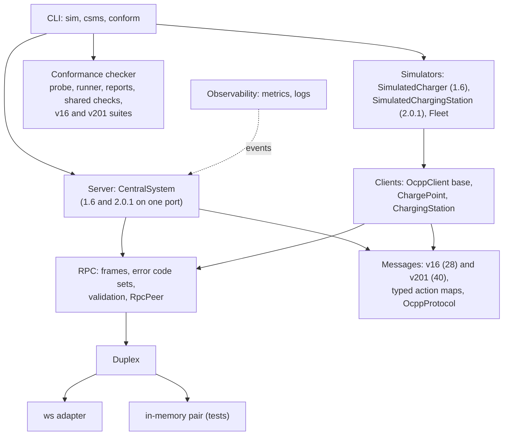

# ocpp-kit

[](https://github.com/houssammehdi/ocpp-kit/actions/workflows/ci.yml)
[](LICENSE)
[](package.json)

**A type-safe OCPP 1.6-J and OCPP 2.0.1 toolkit for Node.js.** ocpp-kit gives you the pieces to
build and test EV-charging back ends:

- an RPC layer that implements the OCPP-J framing rules and the error codes of both versions;
- typed catalogues of all 28 OCPP 1.6 messages and 40 OCPP 2.0.1 messages, checked at compile
  time and validated at run time;
- a Central System that serves both versions on one port, and clients for both, with TLS and
  client certificates (Security Profiles 1 to 3) and a persistent offline queue;
- simulators of a 1.6 charge point and a 2.0.1 charging station (Device Model, TransactionEvent,
  smart charging, reservations, firmware and more), for load tests of mixed fleets;
- a conformance checker for Central Systems with 31 OCPP 1.6 checks and 32 OCPP 2.0.1 checks;
- Prometheus metrics and structured logs.

All schemas were written by hand from the public specifications and then compared field by
field with the official JSON schemas.

```ts
const cs = new CentralSystem<OcppSubprotocol>({ protocols: ['ocpp2.0.1', 'ocpp1.6'] });
const now = () => new Date().toISOString();

// OCPP 1.6 on the server itself, OCPP 2.0.1 on cs.v201; requests and responses are typed.
cs.handle('BootNotification', () => ({ status: 'Accepted', currentTime: now(), interval: 300 }));
cs.v201.handle('BootNotification', ({ chargingStation }) => ({
  status: chargingStation.vendorName === 'Acme' ? 'Accepted' : 'Pending',
  currentTime: now(),
  interval: 300,
}));
await cs.listen(9220);
```

## Contents

- [Features](#features)
- [OCPP in 60 seconds](#ocpp-in-60-seconds)
- [Quickstart](#quickstart)
- [Architecture](#architecture)
- [Usage](#usage)
- [Simulator and CLI](#simulator-and-cli)
- [Conformance checker](#conformance-checker)
- [Observability](#observability)
- [Performance](#performance)
- [Design notes](#design-notes)
- [Spec coverage](#spec-coverage)
- [Testing](#testing)
- [Limitations](#limitations)
- [Project layout](#project-layout)

More in [`docs/`](docs): [architecture](docs/architecture.md),
[conformance checks](docs/conformance.md), [OCPP 1.6 field notes](docs/ocpp16-field-notes.md)
and [OCPP 2.0.1 field notes](docs/ocpp201-field-notes.md). `npm run docs` builds the API
reference with TypeDoc.

## Features

- **RPC layer** (`src/rpc`): parses and serializes `CALL`, `CALLRESULT` and `CALLERROR` frames,
  maps malformed input to the error codes of the connection's OCPP version, correlates responses
  by message id, applies a timeout to each call, queues outgoing calls so only one is
  outstanding at a time, and validates payloads in both directions. It runs over any `Duplex`,
  so unit tests need no sockets, and it is fuzzed with property-based tests.
- **Message catalogues** (`src/messages`): TypeBox schemas for all 28 OCPP 1.6 messages with
  their feature profiles, and for 40 OCPP 2.0.1 messages with their functional blocks
  ([exact list](#ocpp-201-coverage)). The same objects give you runtime validators and static
  types. The 2.0.1 types live in the `v201` namespace (`v201.TransactionEventRequest`).
- **Central System** (`src/server`): negotiates `ocpp1.6`, `ocpp2.0.1` or both, takes the
  identity from the URL path, serves `ws://` or `wss://`, checks Basic auth (Security Profiles 1
  and 2) and client certificates with a configurable identity binding (Profile 3), keeps a
  connection registry with a policy for duplicate identities, emits typed events, checks
  liveness with pings and shuts down gracefully.
- **Clients** (`src/client`): `ChargePoint` (1.6) and `ChargingStation` (2.0.1) reconnect with
  exponential backoff and full jitter, pin CAs or certificate fingerprints, present client
  certificates, and put transaction messages through a persistent offline queue that replays
  them in order after an accepted BootNotification.
- **Simulators** (`src/simulator`): `SimulatedCharger` implements all six 1.6 feature profiles;
  `SimulatedChargingStation` implements the 2.0.1 messages listed below with EVSEs, a Device
  Model, TransactionEvent driven by TxStartPoint/TxStopPoint, offline queueing, authorization,
  smart charging, availability, reservations, firmware updates and log uploads. Both have a
  seeded autopilot of drivers, and `Fleet` runs many of either kind, or both.
- **Conformance checker** (`src/conformance`, `ocpp-kit conform`): 31 checks of a 1.6 Central
  System and 32 of a 2.0.1 CSMS, each with a specification reference and a MUST/SHOULD level,
  as text, JSON or JUnit.
- **Observability** (`src/observability`): Prometheus metrics (connections, calls by action and
  result, latency histograms, errors) and structured logs for a Central System of either version.
- **CLI**: `ocpp-kit sim` load-tests a CSMS with N chargers (`--ocpp 1.6|2.0.1|mixed`),
  `ocpp-kit csms` runs a demo Central System for both versions with a live table, remote
  control, metrics and JSON logs, and `ocpp-kit conform` checks a CSMS (`--ocpp 1.6|2.0.1`).

## OCPP in 60 seconds

The Open Charge Point Protocol (OCPP) is how a charging station talks to its management back
end (the Central System, or CSMS). Each station opens one WebSocket to
`wss://csms.example.com/ocpp/<identity>` with the subprotocol `ocpp1.6` or `ocpp2.0.1`. Both
sides then exchange JSON arrays:

```text
[2, "<messageId>", "<Action>", {payload}]                              CALL
[3, "<messageId>", {payload}]                                          CALLRESULT
[4, "<messageId>", "<errorCode>", "<errorDescription>", {errorDetails}] CALLERROR
```

In 1.6 the charge point sends `BootNotification`, `StatusNotification`, `Heartbeat`,
`Authorize`, `StartTransaction`, `MeterValues` and `StopTransaction`, and the Central System sends
commands such as `RemoteStartTransaction` or `SetChargingProfile`. 2.0.1 keeps the framing but
changes the messages: one `TransactionEvent` (Started, Updated, Ended) replaces the three
transaction messages, the station chooses the transaction id, configuration becomes a Device
Model of components and variables, and a station is made of EVSEs with connectors. Neither side
should send a new CALL while its previous one is unanswered.

## Quickstart

Requirements: Node.js 20 or newer. The package is not yet published to npm, so install it from
source:

```bash
git clone https://github.com/houssammehdi/ocpp-kit.git
cd ocpp-kit
npm ci
npm run build

# Terminal 1: a demo Central System for OCPP 1.6 and 2.0.1, with a live table
node dist/cli/main.js csms --port 9220

# Terminal 2: 50 simulated chargers, alternating 1.6 and 2.0.1, started 5 per second
node dist/cli/main.js sim --url ws://localhost:9220 --count 50 --ramp 5/s --ocpp mixed

# Or check the demo CSMS against the specification
node dist/cli/main.js conform --url ws://localhost:9220 --identity CP001
node dist/cli/main.js conform --url ws://localhost:9220 --identity CS001 --ocpp 2.0.1
```

Run `npm link` if you want the `ocpp-kit` command on your `PATH`. The runnable examples in
[`examples/`](examples) use `tsx`:

```bash
npm run example:csms            # 1.6 Central System on :9220 (Ctrl-C to stop)
npm run example:charge-point    # one 1.6 session against it
npm run example:smart-charging  # self-contained: charging profiles in action
npm run example:multi-version   # self-contained: one Central System, a 1.6 and a 2.0.1 client
```

## Architecture



The RPC core only sees a `Duplex` (`send`, `close` and one receiver), two action catalogues and
an error code set, so nothing in it is specific to a protocol version. A version is an
`OcppProtocol` (`OCPP16_PROTOCOL`, `OCPP201_PROTOCOL`): subprotocol, catalogues, error codes and
the transaction messages a client must deliver reliably. The server, the client base class and
the conformance suites are written against it. [docs/architecture.md](docs/architecture.md) has
the details.

## Usage

### Central System (OCPP 1.6)

```ts
import { CentralSystem } from 'ocpp-kit';

const cs = new CentralSystem({
  basePath: '/ocpp', // ws://host:9220/ocpp/<identity>
  authenticate: ({ identity, password }) => lookupKey(identity) === password, // Security Profile 1
  requireAcceptedBoot: true, // SecurityError for anything before an accepted BootNotification
});

cs.handle('BootNotification', (req, { connection }) => {
  console.log(connection.identity, req.chargePointVendor); // req is fully typed
  return { status: 'Accepted', currentTime: new Date().toISOString(), interval: 300 };
});
cs.handle('StartTransaction', async ({ idTag, connectorId, meterStart }) => ({
  idTagInfo: { status: 'Accepted' },
  transactionId: await db.startSession(idTag, connectorId, meterStart),
}));

cs.on('connect', (cp) => console.log(`${cp.identity} online`));
await cs.listen(9220);

// Calls towards a charge point are typed request -> response too.
const { status } = await cs.call('CP-001', 'RemoteStartTransaction', { idTag: '04A2B3C4' });
await cs.close(); // closes every connection with 1001, then the HTTP server
```

`cs.attach(httpsServer)` attaches to an existing HTTP or HTTPS server instead of creating one.
Code written for 0.2.0 keeps working: without `protocols`, a `CentralSystem` speaks 1.6 only.

### One Central System for OCPP 1.6 and 2.0.1

```ts
import { CentralSystem, type OcppSubprotocol } from 'ocpp-kit';

const cs = new CentralSystem<OcppSubprotocol>({ protocols: ['ocpp2.0.1', 'ocpp1.6'] });

cs.handle('Heartbeat', () => ({ currentTime: new Date().toISOString() })); // 1.6
cs.v201 // 2.0.1, typed with the 2.0.1 catalogue
  .handle('Heartbeat', () => ({ currentTime: new Date().toISOString() }))
  .handle('TransactionEvent', ({ eventType, seqNo, transactionInfo, offline }) => {
    // De-duplicate on (identity, transactionId, seqNo): events are delivered at least once.
    return eventType === 'Ended' ? {} : { idTokenInfo: { status: 'Accepted' } };
  });

cs.on('connect', (connection) => console.log(connection.identity, connection.version)); // '1.6' | '2.0.1'

await cs.v201.call('CS-201', 'RequestStartTransaction', {
  remoteStartId: 1,
  idToken: { idToken: '04A2B3C4', type: 'ISO14443' },
  evseId: 1,
});
```

The list is the server's order of preference: a station that offers both subprotocols gets
2.0.1. Registrations (`requireAcceptedBoot`) are kept per subprotocol and identity. See
[`examples/multi-version.ts`](examples/multi-version.ts) for a complete, runnable version.

### Charge Point (1.6) and Charging Station (2.0.1)

```ts
import { ChargePoint, ChargingStation, FileQueueStore } from 'ocpp-kit';

const cp = new ChargePoint({
  identity: 'CP-001',
  url: 'wss://csms.example.com/ocpp',
  password: process.env.AUTH_KEY,
  reconnect: { initialDelayMs: 1_000, maxDelayMs: 60_000 }, // full jitter by default
  offlineQueue: { store: new FileQueueStore('/var/lib/cp/queue.json') }, // survives restarts
});
cp.handle('Reset', ({ type }) => ({ status: type === 'Soft' ? 'Accepted' : 'Rejected' }));
await cp.connect();
await cp.call('BootNotification', { chargePointVendor: 'Acme', chargePointModel: 'W22' });

// 2.0.1: same options, the 2.0.1 catalogue, and TransactionEvent through the offline queue.
const station = new ChargingStation({ identity: 'CS-001', url: 'wss://csms.example.com/ocpp' });
station.handle('RequestStartTransaction', () => ({ status: 'Accepted' }));
await station.connect();
await station.call('BootNotification', {
  chargingStation: { vendorName: 'Acme', model: 'Wallbox 22' },
  reason: 'PowerUp',
});
// Resolves once the CSMS has answered, even if the link drops meanwhile.
await station.call('TransactionEvent', {
  eventType: 'Started',
  timestamp: new Date().toISOString(),
  triggerReason: 'Authorized',
  seqNo: 0,
  transactionInfo: { transactionId: crypto.randomUUID() },
  evse: { id: 1, connectorId: 1 },
  idToken: { idToken: '04A2B3C4', type: 'ISO14443' },
});
```

### TLS and client certificates (Security Profiles 2 and 3)

```ts
import { readFileSync } from 'node:fs';
import { CentralSystem, ChargePoint } from 'ocpp-kit';

const cs = new CentralSystem({
  tls: {
    cert: readFileSync('server.crt'), // chain allowed
    key: readFileSync('server.key'),
    ca: readFileSync('charger-ca.crt'), // CAs that issue charge point certificates
  },
  // Profile 3: require a certificate whose CN or a subjectAltName is the identity.
  clientCertificates: { identityBinding: 'cn-or-san' }, // or 'cn', 'san', false, (id, cert) => ...
});
await cs.listen(443);

const cp = new ChargePoint({
  identity: 'CP-001',
  url: 'wss://csms.example.com/ocpp',
  tls: {
    ca: readFileSync('csms-ca.crt'), // trust only this CA
    cert: readFileSync('cp-001.crt'),
    key: readFileSync('cp-001.key'),
    // pinnedFingerprints: ['AB:CD:...'], // optionally pin the server certificate
  },
});
```

The same options work for `ChargingStation` and for a `CentralSystem` serving 2.0.1. For
Profile 2, leave out `clientCertificates` and the client certificate, and use `authenticate` /
`password` as above. With `clientCertificates: { required: false }`, both kinds of charge points
can share one endpoint. A refused charge point gets HTTP 403 (certificate) or 401 (password),
and the server emits a `rejected` event saying why. The CLI has the same options
(`ocpp-kit csms --tls-cert --tls-key --tls-ca`, `ocpp-kit sim --ca --cert --key`).

### The RPC layer on its own

```ts
import {
  ChargingStationToCsms,
  CsmsToChargingStation,
  createDuplexPair,
  OCPP201_ERROR_CODES,
  RpcPeer,
} from 'ocpp-kit';

const [a, b] = createDuplexPair(); // or webSocketDuplex(ws)
const csms = new RpcPeer(b, {
  inbound: ChargingStationToCsms,
  outbound: CsmsToChargingStation,
  errorCodes: OCPP201_ERROR_CODES, // the default is OCPP16_ERROR_CODES
});
const station = new RpcPeer(a, {
  inbound: CsmsToChargingStation,
  outbound: ChargingStationToCsms,
  errorCodes: OCPP201_ERROR_CODES,
  callTimeoutMs: 10_000,
});

csms.handle('Heartbeat', () => ({ currentTime: new Date().toISOString() }));
await station.call('Heartbeat', {});
```

How the RPC layer maps faults to CALLERROR codes:

| Situation                                                          | OCPP 1.6                       | OCPP 2.0.1                      |
| ------------------------------------------------------------------ | ------------------------------ | ------------------------------- |
| Not JSON, not an array, wrong element types, message id > 36 chars | `FormationViolation`           | `RpcFrameworkError`             |
| Too few elements                                                   | `ProtocolError`                | `RpcFrameworkError`             |
| Payload not an object, undeclared payload property                 | `FormationViolation`           | `FormatViolation`               |
| Unknown message type id (not 2, 3 or 4)                            | no reply: ignored (§4.1.3)     | no reply: ignored (§4.1.3)      |
| CALL whose message id is still being handled                       | `GenericError`                 | `GenericError`                  |
| Action not in the catalogue                                        | `NotImplemented`               | `NotImplemented`                |
| Known action without a registered handler                          | `NotSupported`                 | `NotSupported`                  |
| Required field missing, array too short or too long                | `OccurenceConstraintViolation` | `OccurrenceConstraintViolation` |
| Wrong JSON type (e.g. `"1"` for an integer)                        | `TypeConstraintViolation`      | `TypeConstraintViolation`       |
| Right type, invalid value (enum, length, range, date-time)         | `PropertyConstraintViolation`  | `PropertyConstraintViolation`   |
| Handler threw a non-`RpcError`, or produced an invalid response    | `InternalError`                | `InternalError`                 |
| Handler threw `new RpcError(code, ...)`                            | that code                      | that code, in 2.0.1 spelling    |

A reply is only possible when the message id is recoverable. A received CALLERROR code that
the connection's version does not define is reported as `GenericError`, with the code as sent
in `originalErrorCode`.

## Simulator and CLI

### `ocpp-kit sim`

```bash
ocpp-kit sim --url ws://localhost:9220 --count 50 --ramp 5/s --ocpp mixed \
  --connectors 2 --max-power 22 --meter-interval 60s --idle 30s-5m --seed 42
```

`--ocpp 1.6` (default) runs `SimulatedCharger`s, `--ocpp 2.0.1` runs `SimulatedChargingStation`s
and `--ocpp mixed` alternates them. Every simulated charger boots, retries while `Pending` or
`Rejected`, applies the heartbeat interval it is given, reports its connectors, models an EV
battery (constant power up to about 80 % SoC, then a CV taper, with charging losses, integrated
on a fixed tick so a seed always produces the same values), serves every command of its
catalogue, and with the autopilot (the default for the CLI) lets seeded virtual drivers arrive,
swipe a card, charge until full or until they leave, and unplug.

A 1.6 charge point:

- runs the connector state machine of OCPP 1.6 §4.9 (Reserved included);
- authorizes id tags case-insensitively through its Local Authorization List and Authorization
  Cache, following `LocalPreAuthorize`, `LocalAuthorizeOffline`, `AllowOfflineTxForUnknownId`
  and `StopTransactionOnInvalidId`, with parentIdTag groups;
- takes reservations (connector 0 only with `ReserveConnectorZeroSupported`);
- plays firmware updates and diagnostics uploads through all their status notifications, with
  retries and injectable failures (nothing is transferred);
- samples meter values per `MeterValuesSampledData` and `ClockAlignedDataInterval`;
- applies charging profiles (stacking, purposes, Absolute/Relative/Recurring schedules,
  GetCompositeSchedule) and splits a ChargePointMaxProfile across connectors with max-min
  fairness.

A 2.0.1 charging station:

- has EVSEs with one connector each and a Device Model with the standard controller variables
  (`OCPPCommCtrlr`, `TxCtrlr`, `AuthCtrlr`, `SampledDataCtrlr`, `SmartChargingCtrlr`, ...),
  served by GetVariables, SetVariables, GetBaseReport and GetReport (multi-part NotifyReport);
- starts and ends transactions at the configured `TxStartPoint` and `TxStopPoint`
  (`EVConnected`, `Authorized`, `PowerPathClosed`, `EnergyTransfer`), and reports them with
  TransactionEvent Started/Updated/Ended, with seqNo, triggerReason, chargingState, periodic
  and clock-aligned meter values, and `offline: true` for events generated while offline;
- authorizes idTokens (value and type) through its Local Authorization List, Authorization
  Cache and Authorize, with group idTokens;
- applies the 2.0.1 profile rules of K01 (see the
  [field notes](docs/ocpp201-field-notes.md#smart-charging-tightened-the-rules)), external
  constraints with NotifyChargingLimit / ClearedChargingLimit, GetChargingProfiles with
  ReportChargingProfiles, and GetCompositeSchedule;
- serves availability, reservations (with ReservationStatusUpdate), RequestStart/StopTransaction,
  UnlockConnector, TriggerMessage, Reset (including `OnIdle`), firmware updates and log uploads
  (simulated), and reports faults with NotifyEvent and security events with
  SecurityEventNotification.

It prints a live status line. `--duration 10m --json` makes it stop by itself and print the
final statistics as JSON, which is handy in CI pipelines of a CSMS.

A sample run (4-vCPU cloud VM, 1-minute load average below 1, Node 22, CSMS and simulator as two
processes on the same host; 250 charge points connected with 1.6 and 250 with 2.0.1),
reproducible with:

```bash
node dist/cli/main.js csms --port 9221 --no-table &
node dist/cli/main.js sim --ocpp mixed --url ws://localhost:9221 --count 500 --ramp 100/s \
  --meter-interval 10s --idle 5s-30s --duration 60s
```

```text
Final: t=00:01:00 started 500/500 online 500 booted 500 | tx 1000 (done 0) | 13186.8 kW 135.3 kWh | calls 9240 err 0 | rtt p50 0.4 p95 0.8 p99 2.2 ms
```

The round-trip times are measured on loopback, so they show the toolkit's own overhead and not
what a real network adds. They are indicative: on a busy machine the tail latencies grow.

### `ocpp-kit csms`

```bash
ocpp-kit csms --port 9220 --heartbeat 60s --auto-start 30s [--ocpp both|1.6|2.0.1]
```

A demo Central System that speaks 1.6 and 2.0.1 on one port by default. It accepts every
charger and every id tag and hands out 1.6 transaction ids. On a terminal it redraws a table of
chargers (with their OCPP version), connector or EVSE states, power, energy and message counts
every second, and accepts commands, which it maps to the charger's version (for example
`start` becomes RemoteStartTransaction or RequestStartTransaction, and `config` takes a 1.6 key
or a 2.0.1 `Component.Variable`):

```text
start <id> [connector] [idTag]        stop <id> [connector|txId]
limit <id> <kW|off>                   reset <id> [hard]
reserve <id> <connector> <idTag> [minutes]    cancel <id> <reservationId>
trigger <id> <message> [connector]    config <id> <key> [value]
firmware <id> <url>                   diagnostics <id> <url>
list   help   quit
```

`--auto-start` remote-starts one idle connector on every connected charger at each interval.
`--password` enables Basic auth, `--tls-cert`/`--tls-key` serve `wss://` and `--tls-ca`
requires client certificates. `--metrics-port` serves Prometheus metrics, `--log-json` writes
structured logs to stdout, and `--no-table` switches to plain log lines, which also happens
automatically when stdout is not a TTY. The demo answers a replayed StartTransaction with the
same transaction id, ignores a replayed TransactionEvent (same transaction and seqNo), and
answers DataTransfer with `UnknownVendorId`.

### Programmatic use

```ts
import { Fleet, SimulatedCharger, SimulatedChargingStation, stationFactory } from 'ocpp-kit';

const charger = new SimulatedCharger({ identity: 'SIM-1', url: 'ws://localhost:9220' });
await charger.start();
charger.plugIn(1, { batteryKWh: 77, initialSoc: 0.2, targetSoc: 0.9, maxPowerW: 11_000 });
await charger.swipe(1, '04A2B3C4');

const station = new SimulatedChargingStation({ identity: 'CS-1', url: 'ws://localhost:9220' });
await station.start();
station.deviceModel; // components and variables, as GetVariables sees them
station.evses[0]; // { status, transactionId, chargingState, powerW, energyWh, soc, ... }

const fleet = new Fleet({
  url: 'ws://localhost:9220',
  count: 200,
  ratePerSecond: 20,
  seed: 7,
  create: stationFactory({ autopilot: true }), // 2.0.1; chargerFactory() for 1.6
});
await fleet.start();
fleet.stats(); // connected, active transactions, kW, kWh, call latency p50/p95/p99, ...
```

## Conformance checker

`ocpp-kit conform` connects to a Central System as a 1.6 charge point (31 checks) or, with
`--ocpp 2.0.1`, as a 2.0.1 charging station (32 checks). Both suites check the WebSocket
handshake and subprotocol, Basic auth and client certificates, pings, BootNotification (schema,
RFC 3339 time, interval, clock), Heartbeat, StatusNotification, Authorize, the transaction
messages, DataTransfer, error handling for unknown actions and malformed frames, ignoring
unknown message types and unmatched responses, one outstanding CALL at a time, the validity of
every CALL the Central System sends, Heartbeat latency and duplicate connections. The 2.0.1
suite adds TransactionEvent Started/Updated/Ended, offline and replayed events, main-meter
MeterValues, SecurityEventNotification, and a check that every CALLERROR uses a 2.0.1 code.

```bash
ocpp-kit conform --url ws://localhost:9220 --identity CS001 --ocpp 2.0.1 [--password ...] \
  [--ca ca.pem --cert cs.pem --key cs.key] [--format text|json|junit] [--output report.xml]
```

An excerpt of a 2.0.1 run against the demo CSMS (`ocpp-kit csms --password ... --auto-start 1s`;
the skipped check needs `--cert`):

```text
PASS   MUST    transaction.started: idTokenInfo.status Accepted
               Answers a TransactionEvent Started with a station-generated transactionId [OCPP 2.0.1 Part 2, E01 (Start Transaction options)]
PASS   SHOULD  transaction.replay: the repeated Updated event was answered like the first
               Answers a re-sent TransactionEvent (same transaction and seqNo) without a CALLERROR [Robustness: stations re-send TransactionEvents until they are answered (OCPP 2.0.1 Part 2, E13)]
PASS   MUST    rpc.error-codes: all CALLERRORs used OCPP 2.0.1 codes: NotImplemented, OccurrenceConstraintViolation, TypeConstraintViolation, PropertyConstraintViolation, RpcFrameworkError, FormatViolation
               Uses only the error codes of OCPP 2.0.1 in its CALLERRORs [OCPP-J 2.0.1 (Part 4), RPC Framework Error Codes]
...
32 checks in 6.8 s: 31 passed, 0 failed (0 MUST, 0 SHOULD), 1 skipped, 0 error(s)
Result: PASS (no MUST check failed)
```

MUST failures make the command exit with status 1, SHOULD failures are reported only. The
probe answers the Central System's own CALLs like a charger that declines everything, but it
does create test transactions, so run it against a test system. Every check is proven to be
able to fail by tests against a deliberately broken fixture CSMS, and CI runs both suites
against the demo CSMS. [docs/conformance.md](docs/conformance.md) lists every check, its
reference and what it accepts.

## Observability

```ts
import { attachLogger, instrumentCentralSystem, jsonLines } from 'ocpp-kit';

const metrics = instrumentCentralSystem(cs); // Prometheus text via metrics.render()
http.createServer((_req, res) => res.end(metrics.render())).listen(9464);
attachLogger(cs, jsonLines(process.stdout)); // one JSON object per event
```

The metrics are `ocpp_connected_charge_points`, `ocpp_connections_total`,
`ocpp_disconnections_total`, `ocpp_rejected_connections_total{reason}`,
`ocpp_inbound_calls_total{action,result}`, `ocpp_outbound_calls_total{action,result}` (result
`ok`, a CALLERROR code, `timeout`, `closed`, ...), the latency histograms
`ocpp_inbound_call_duration_seconds` and `ocpp_outbound_call_duration_seconds`, and
`ocpp_bad_messages_total{code}`. Both work on a Central System of either version; action names
outside the catalogue of the connection's version are counted as `unknown`, so a misbehaving
client cannot create unbounded label values, and the log entry of a connection names its OCPP
version. `MetricsRegistry`, `Counter`, `Gauge` and `Histogram` can be used for your own metrics;
there are no dependencies.

## Performance

`npm run bench` measures frame parsing, serialisation and validation, RPC round trips in memory
and over loopback WebSockets, a 1.6 fleet and a mixed 1.6/2.0.1 fleet. One run on a 4-vCPU cloud
VM (Intel Xeon 2.8 GHz, Node 22.22), 1-minute load average 0.56 to 1.01 during the run; every
benchmark is repeated 3 to 5 times and the median repetition shown:

| Benchmark                                                        | Result                                                                       |
| ---------------------------------------------------------------- | ---------------------------------------------------------------------------- |
| `parseFrame`, 668-byte 1.6 MeterValues CALL                      | 241,000 frames/s                                                             |
| `parseFrame`, 956-byte 2.0.1 TransactionEvent CALL               | 170,000 frames/s                                                             |
| `parseFrame`, 85-byte Heartbeat CALLRESULT                       | 1,960,000 frames/s                                                           |
| `serializeFrame`, 1.6 MeterValues CALL                           | 462,000 frames/s                                                             |
| `serializeFrame`, 2.0.1 TransactionEvent CALL                    | 311,000 frames/s                                                             |
| `validatePayload`, 1.6 MeterValues request                       | 1,280,000 payloads/s                                                         |
| `validatePayload`, 2.0.1 TransactionEvent request                | 834,000 payloads/s                                                           |
| RpcPeer in memory, sequential Heartbeat                          | 117,000 calls/s; p50 0.007 ms, p99 0.036 ms                                  |
| RpcPeer in memory, sequential 1.6 MeterValues (5 samples)        | 60,000 calls/s; p50 0.015 ms, p99 0.048 ms                                   |
| RpcPeer in memory, sequential 2.0.1 TransactionEvent (5 samples) | 46,000 calls/s; p50 0.019 ms, p99 0.062 ms                                   |
| WebSocket loopback, 1 client, sequential Heartbeat               | 14,100 calls/s; p50 0.057 ms, p99 0.19 ms                                    |
| WebSocket loopback, 50 clients, each sequential Heartbeat        | 15,900 calls/s; p50 2.9 ms, p99 7.3 ms                                       |
| Fleet: 1,000 1.6 charge points x 2 MeterValues/s for 20 s        | 1,998 of 2,000 msg/s answered, 0 failed; p50 0.51 ms, p95 1.4 ms, p99 2.9 ms |
| Fleet: 2,000 1.6 charge points x 2 MeterValues/s for 20 s        | 3,995 of 4,000 msg/s answered, 0 failed; p50 1.1 ms, p95 5.6 ms, p99 15 ms   |
| Mixed: 500 1.6 + 500 2.0.1 x 2 msg/s for 20 s                    | 1,999 of 2,000 msg/s answered, 0 failed; p50 0.58 ms, p95 1.6 ms, p99 4.0 ms |
| Mixed: 1,000 1.6 + 1,000 2.0.1 x 2 msg/s for 20 s                | 3,991 of 4,000 msg/s answered, 0 failed; p50 1.5 ms, p95 4.9 ms, p99 12 ms   |

The 2.0.1 TransactionEvent is about 30 % slower to parse and serialise than the 1.6 MeterValues
with the same five samples because it is 43 % larger (the `unitOfMeasure` objects and the
transaction info): per byte, both parse at about 160 MB/s. In the fleet runs the difference disappears into the WebSocket and
event-loop costs: the mixed fleet of 2,000 used 63 % of one core against 57 % for 2,000 1.6
charge points. The WebSocket and fleet numbers include both ends in one Node.js process (client
and server share one event loop and one core), so they understate what a separate CSMS process
can do. The answered rate is a little below the offered one because the chargers start
staggered over the first interval; no message failed. The numbers are indicative and vary
between runs; 0.2.0's README reports a run under heavier load (load average 3.0 to 3.4) with
p99 50 ms for the 2,000 charge point fleet. Reproduce with `npm run bench`, or
`npm run bench -- --json` for machine-readable output.

## Design notes

**One outstanding CALL per direction, enforced by a queue.** OCPP-J says a sender should not
send a new CALL before the previous one is answered or has timed out, and many chargers handle
only one request at a time. `RpcPeer.call()` therefore never writes to the socket directly: it
appends to a FIFO queue and sends the next frame only once the current one settles. The timeout
starts when a frame is sent, not when it is queued, so a burst of calls cannot time out while
waiting its turn. Inbound CALLs are served independently, so the two directions never block
each other.

**Validation in both directions.** Inbound requests are validated before a handler runs, so
handlers only ever see well-typed data, and faults get the error code whose definition matches
in the connection's version. Outbound requests are validated before they are sent: a bug in
your code rejects locally with `remote: false` instead of reaching a charger. Your handlers'
responses are validated too, and an invalid one becomes an `InternalError` rather than a
malformed frame. Validators are compiled once per schema with TypeBox's JIT compiler. When
several constraints fail at once, the most structural one wins (format > occurrence > type >
property), which keeps the reported code deterministic.

**One core, two versions.** Versions differ in their catalogues, their error code vocabulary and
the messages a client must deliver reliably, and that is all an `OcppProtocol` holds. Everything
else (framing, correlation, the call queue, reconnects, the offline queue, TLS, the connection
registry, conformance running and reporting) is shared, so a fix in one place fixes both
versions. The 1.6 API is unchanged: `new CentralSystem()` is still `CentralSystem<'ocpp1.6'>`,
and 1.6 handlers are still registered on the server itself.

**Backoff with full jitter.** After a CSMS outage, thousands of chargers reconnect at the same
moment. Plain exponential backoff keeps them in lockstep; with full jitter
(`random(0, min(max, base * 2^n))`) the reconnects spread out across each window. The backoff
counter resets only after a connection has been up for `resetAfterMs`.

**At-least-once, ordered transaction messages.** 1.6 StartTransaction, StopTransaction and
MeterValues, and 2.0.1 TransactionEvent, are persisted before they are sent, delivered strictly
in order and removed only once the Central System has answered. If the connection is lost
mid-flight, the message is sent again after reconnecting, so a CSMS should treat these messages
idempotently. CALLERRORs and timeouts use up to `transactionMessageAttempts` attempts
(`TransactionMessageAttempts` in 1.6, `MessageAttempts` of `OCPPCommCtrlr` in 2.0.1). When the
queue is full, the oldest periodic meter values are evicted first; start and stop messages are
never evicted. In 1.6, messages of a transaction started offline get their transaction id when
StartTransaction.conf arrives; in 2.0.1 the station chooses the id, so nothing needs binding.

**Registration survives reconnects.** With `requireAcceptedBoot`, the server remembers accepted
BootNotifications per subprotocol and identity, not per socket: a charger reconnecting after a
network blip does not boot again, and its replayed transaction messages must not be refused.

**Determinism.** The simulators draw every random decision (EV battery size, SoC, arrival and
dwell times, id tags, 2.0.1 transaction ids) from a per-charger PRNG derived from `--seed` and
the identity. They integrate energy on a fixed tick, and reconnect jitter uses a separate stream
so that network timing cannot shift the scenario.

**Clean-room schemas.** The schemas were written from the specification text in TypeBox, not
generated from the official schema files, and then compared field by field against them with a
script to catch transcription mistakes: for 2.0.1, all 80 request and response schemas against
the OCA schemas shipped in the Python `ocpp` package 2.1.0, with no difference found (the method
is in the [2.0.1 field notes](docs/ocpp201-field-notes.md#how-the-schemas-were-checked)). The
official 1.6 schemas' `multipleOf: 0.1` on decimal fields is deliberately left out, because
floating-point values such as `0.3` would fail it.

## Spec coverage

### OCPP 1.6 coverage

All 28 messages of the six OCPP 1.6 feature profiles are in the typed catalogue
(`ChargePointToCentralSystem`, `CentralSystemToChargePoint`, `ACTION_PROFILES`), validated at run
time, handled by `CentralSystem` and `ChargePoint`, and implemented by the simulator:

| Profile         | Message                       | Direction | Simulator behaviour                                                                     |
| --------------- | ----------------------------- | --------- | --------------------------------------------------------------------------------------- |
| Core            | Authorize                     | CP → CS   | local list, cache, `LocalPreAuthorize`, offline rules, case-insensitive id tags         |
| Core            | BootNotification              | CP → CS   | retries after Pending/Rejected, nothing else before Accepted (§4.2), heartbeat interval |
| Core            | ChangeAvailability            | CS → CP   | Accepted / Scheduled / Rejected, connector 0 for the whole charge point                 |
| Core            | ChangeConfiguration           | CS → CP   | standard keys, read-only flags, value validation, `RebootRequired`, `NotSupported`      |
| Core            | ClearCache                    | CS → CP   | empties the Authorization Cache                                                         |
| Core            | DataTransfer                  | both      | answers `UnknownVendorId`                                                               |
| Core            | GetConfiguration              | CS → CP   | all or listed keys, `unknownKey`, `GetConfigurationMaxKeys`                             |
| Core            | Heartbeat                     | CP → CS   | `HeartbeatInterval`, restarts on change                                                 |
| Core            | MeterValues                   | CP → CS   | sampled and clock-aligned data, measurands with phases, offline queue                   |
| Core            | RemoteStartTransaction        | CS → CP   | TxProfile, `AuthorizeRemoteTxRequests`, `ConnectionTimeOut`, reservations               |
| Core            | RemoteStopTransaction         | CS → CP   | stops with reason `Remote`                                                              |
| Core            | Reset                         | CS → CP   | Soft/Hard: stops transactions, reboots, boots again                                     |
| Core            | StartTransaction              | CP → CS   | reservationId, offline queue with late-bound transaction id                             |
| Core            | StatusNotification            | CP → CS   | every transition of §4.9 incl. Reserved, connector 0                                    |
| Core            | StopTransaction               | CP → CS   | stop reasons, `transactionData` (`StopTxnSampledData`/`AlignedData`), invalid-id rules  |
| Core            | UnlockConnector               | CS → CP   | ends the transaction (`UnlockCommand`)                                                  |
| Firmware Mgmt   | UpdateFirmware                | CS → CP   | `retrieveDate`, `retries`/`retryInterval`, simulated download and install, reboot       |
| Firmware Mgmt   | FirmwareStatusNotification    | CP → CS   | Downloading, Downloaded, Installing, Installed and the failure statuses                 |
| Firmware Mgmt   | GetDiagnostics                | CS → CP   | file name, time window, retries, simulated upload                                       |
| Firmware Mgmt   | DiagnosticsStatusNotification | CP → CS   | Uploading, Uploaded, UploadFailed                                                       |
| Local Auth List | GetLocalListVersion           | CS → CP   | current version (0 when empty, -1 when the profile is disabled)                         |
| Local Auth List | SendLocalList                 | CS → CP   | Full and Differential, `VersionMismatch`, `Failed`, `NotSupported`, max length          |
| Reservation     | ReserveNow                    | CS → CP   | Accepted/Faulted/Occupied/Rejected/Unavailable, expiry, parentIdTag, connector 0 rules  |
| Reservation     | CancelReservation             | CS → CP   | Accepted / Rejected                                                                     |
| Remote Trigger  | TriggerMessage                | CS → CP   | every `requestedMessage`, per connector or connector 0                                  |
| Smart Charging  | SetChargingProfile            | CS → CP   | stacking, purposes, all kinds, limits enforced                                          |
| Smart Charging  | ClearChargingProfile          | CS → CP   | by id or by criteria                                                                    |
| Smart Charging  | GetCompositeSchedule          | CS → CP   | merged schedule incl. hardware limit, A or W                                            |

Security Profiles 1 to 3 of the OCPP 1.6 security whitepaper are supported by the server and
the client (Basic auth, TLS, client certificates). The whitepaper's additional messages are not
implemented.

### OCPP 2.0.1 coverage

40 of the 64 OCPP 2.0.1 messages are in the typed catalogue (`ChargingStationToCsms`,
`CsmsToChargingStation`, `ACTION_BLOCKS`), validated at run time and handled by `CentralSystem`
(`cs.v201`) and `ChargingStation`. The simulated station answers every CSMS message listed here
and sends every station message except the two marked. ↑ is station to CSMS, ↓ CSMS to station.

| Functional block (Part 2)  | Messages                                                                                                                                                                                                                 | Simulator behaviour                                                                                                             |
| -------------------------- | ------------------------------------------------------------------------------------------------------------------------------------------------------------------------------------------------------------------------ | ------------------------------------------------------------------------------------------------------------------------------- |
| A Security                 | ↑ `SecurityEventNotification`                                                                                                                                                                                            | startup, reboot, firmware update, invalid firmware signature, security reconfiguration                                          |
| B Provisioning             | ↑ `BootNotification`, ↑ `NotifyReport`, ↓ `GetBaseReport`, ↓ `GetReport`, ↓ `GetVariables`, ↓ `SetVariables`, ↓ `SetNetworkProfile`, ↓ `Reset`                                                                           | Device Model with attributes, mutability and value checks; multi-part reports; Reset Immediate and OnIdle                       |
| C Authorization            | ↑ `Authorize`, ↓ `ClearCache`                                                                                                                                                                                            | idToken value and type, Authorization Cache, group idTokens                                                                     |
| D Local Authorization List | ↓ `GetLocalListVersion`, ↓ `SendLocalList`                                                                                                                                                                               | Full and Differential updates, version mismatch                                                                                 |
| E Transactions             | ↑ `TransactionEvent`, ↓ `GetTransactionStatus`                                                                                                                                                                           | TxStartPoint/TxStopPoint, seqNo, offline queue and replay, queued-message status                                                |
| F Remote Control           | ↓ `RequestStartTransaction`, ↓ `RequestStopTransaction`, ↓ `UnlockConnector`, ↓ `TriggerMessage`                                                                                                                         | remote start with charging profile and remoteStartId, triggers of the station's own messages                                    |
| G Availability             | ↑ `StatusNotification`, ↑ `Heartbeat`, ↓ `ChangeAvailability`                                                                                                                                                            | per-connector status, Operative/Inoperative for station and EVSE, Scheduled while charging                                      |
| H Reservation              | ↓ `ReserveNow`, ↓ `CancelReservation`, ↑ `ReservationStatusUpdate`                                                                                                                                                       | specific EVSE or any EVSE, expiry, group idTokens                                                                               |
| J Meter Values             | ↑ `MeterValues`                                                                                                                                                                                                          | clock-aligned values of idle EVSEs (AlignedDataSendDuringIdle), the main meter (EVSE 0) on trigger                              |
| K Smart Charging           | ↓ `SetChargingProfile`, ↓ `GetChargingProfiles`, ↑ `ReportChargingProfiles`, ↓ `ClearChargingProfile`, ↓ `GetCompositeSchedule`, ↑ `NotifyChargingLimit`, ↑ `ClearedChargingLimit`, ↑ `NotifyEVChargingNeeds` (not sent) | K01 acceptance rules, stacking, external constraints, max-min fair sharing between EVSEs; no ISO 15118, so no EV charging needs |
| L Firmware Management      | ↓ `UpdateFirmware`, ↑ `FirmwareStatusNotification`                                                                                                                                                                       | simulated download, signature check and install, retries, reboot                                                                |
| N Diagnostics              | ↓ `GetLog`, ↑ `LogStatusNotification`, ↑ `NotifyEvent`                                                                                                                                                                   | simulated log upload with retries; connector faults as events                                                                   |
| P Data Transfer            | ↑↓ `DataTransfer` (↑ not sent)                                                                                                                                                                                           | answers UnknownVendorId                                                                                                         |

Not implemented (24): certificate management (`CertificateSigned`, `DeleteCertificate`,
`Get15118EVCertificate`, `GetCertificateStatus`, `GetInstalledCertificateIds`,
`InstallCertificate`, `SignCertificate`), display messages (`ClearDisplayMessage`,
`GetDisplayMessages`, `NotifyDisplayMessages`, `SetDisplayMessage`), monitoring
(`ClearVariableMonitoring`, `GetMonitoringReport`, `NotifyMonitoringReport`,
`SetMonitoringBase`, `SetMonitoringLevel`, `SetVariableMonitoring`), tariff and cost
(`CostUpdated`), customer information (`CustomerInformation`, `NotifyCustomerInformation`),
ISO 15118 schedules (`NotifyEVChargingSchedule`) and local firmware publishing
(`PublishFirmware`, `PublishFirmwareStatusNotification`, `UnpublishFirmware`). A CSMS built on
ocpp-kit answers a CALL of one of them with `NotImplemented`. Security Profiles 1 to 3 are
supported at the transport level (Basic auth, TLS, client certificates).

## Testing

```bash
npm test              # about 950 unit, property-based and integration tests (vitest)
npm run test:coverage # with a v8 coverage report
npm run lint && npm run typecheck && npm run format:check && npm run build && npm run docs
npm run bench -- --quick
```

What the tests cover:

- **Framing and RpcPeer**: every frame type, arity errors, bad ids, error-code mapping and
  priority in both versions, translation between the versions' codes, correlation, the
  one-outstanding-CALL queue, timeouts under fake timers, aborts, reused ids, stray frames and
  validation in both directions. Property-based tests (fast-check) check that the parser never
  throws and round-trips every frame, that every CALL gets exactly one well-formed answer with a
  code of the connection's version, and that no random interleaving of calls, answers, timeouts
  and aborts ever leaves two CALLs outstanding. `FC_SEED` replays a failure.
- **Messages**: an example request and response of every 2.0.1 message is validated, and
  mutations of them are refused with the fitting code.
- **Server and clients**: subprotocol negotiation and preference, per-version handlers,
  registration per subprotocol; backoff and jitter; reconnect cycles; ordered replay after an
  accepted boot; retry, eviction and drop rules; persisted queues; transactions started offline.
- **Simulators**: every 1.6 connector transition and command; for 2.0.1 the Device Model,
  transactions at each TxStartPoint/TxStopPoint, offline queueing, authorization, K01 profile
  rules, availability, reservations, firmware and log sequences, and seed determinism.
- **Security profiles**: `wss://` with Basic auth, CA pinning and fingerprint pinning, client
  certificates bound by CN, SAN or a custom rule, and refusals of foreign and untrusted
  certificates, and a 2.0.1 conformance run over TLS. The certificates are generated with the `openssl` CLI into
  a temporary directory for each run (no key is committed); the TLS tests are skipped with a
  message when `openssl` is missing.
- **Conformance checker**: both suites against a correct fixture CSMS and the demo CSMS, and
  every check against a fixture broken for exactly that check.
- **Integration over real WebSockets** (a mixed 1.6/2.0.1 fleet and the 2.0.1 use cases), the
  **observability** helpers and the **CLI** commands in process.

CI (GitHub Actions) runs lint, format check, typecheck, tests, build, the API docs build and a
benchmark smoke run on Node 20 and 22, and runs both conformance suites against the demo CSMS.

## Limitations

- **OCPP 2.0.1 is partial**: 40 of 64 messages ([list above](#ocpp-201-coverage)). Certificate
  management, display messages, variable monitoring, cost, customer information and ISO 15118
  are not implemented. OCPP 2.1 is not implemented.
- The 2.0.1 spec references of the conformance checks name use cases (E01) and Part 4 sections
  by title; only OCPP-J 2.0.1 §4.1.3 is cited by number. The checks are not the OCA
  certification tests.
- The messages added by the OCPP 1.6 security whitepaper are not implemented; Security
  Profiles 1 to 3 are.
- The offline queue gives at-least-once delivery. A Central System has to de-duplicate a
  message that is sent again after a connection dropped mid-flight.
- `requireAcceptedBoot` keeps registrations in memory, so a restarted server forgets them.
- The simulators integrate energy on a fixed tick. If the event loop is saturated, simulated
  time runs slower than wall-clock time, although meter values remain internally consistent.
  Firmware, diagnostics and log transfers are simulated; nothing is downloaded or uploaded. The
  2.0.1 station has one connector per EVSE and implements a subset of the standard variables.
  ocpp-kit numbers `seqNo` per transaction from 0; the specification does not fix a start value.
- The conformance checker tests what a charge point can observe. A Central System that answers
  `Pending` or `Rejected` to its BootNotification cannot be checked beyond the registration.
- The demo CSMS is meant for testing and demos: it authorizes everything and keeps its state
  in memory.
- The package is not yet published to npm.

## Project layout

```text
src/
  rpc/            frames, error code sets, validation, OcppProtocol, Duplex, RpcPeer
  messages/v16/   hand-written schemas of all 28 OCPP 1.6 messages, catalogue, OCPP16_PROTOCOL
  messages/v201/  hand-written schemas of 40 OCPP 2.0.1 messages, catalogue, OCPP201_PROTOCOL
  transport/      ws adapter, subprotocols
  server/         CentralSystem, connections per version, Basic auth, certificate binding
  client/         OcppClient, ChargePoint, ChargingStation, backoff, offline queue + stores
  simulator/      1.6 charger and its models, shared metering, EV and smart-charging engine,
                  fleet; v201/ holds the 2.0.1 station, Device Model, authorization,
                  smart charging, firmware and logs
  conformance/    probe, runner, reports; common/ shared checks; v16/ and v201/ the suites
  observability/  metrics registry, Prometheus exposition, CentralSystem metrics and logs
  cli/            ocpp-kit sim / csms / conform, demo CSMS, argument parsing
bench/            npm run bench
docs/             architecture, conformance checks, OCPP 1.6 and 2.0.1 field notes
examples/         runnable examples (tsx)
test/             unit, property-based and integration tests (vitest)
```

## License

[MIT](LICENSE) © 2026 Houssam Mehdi
