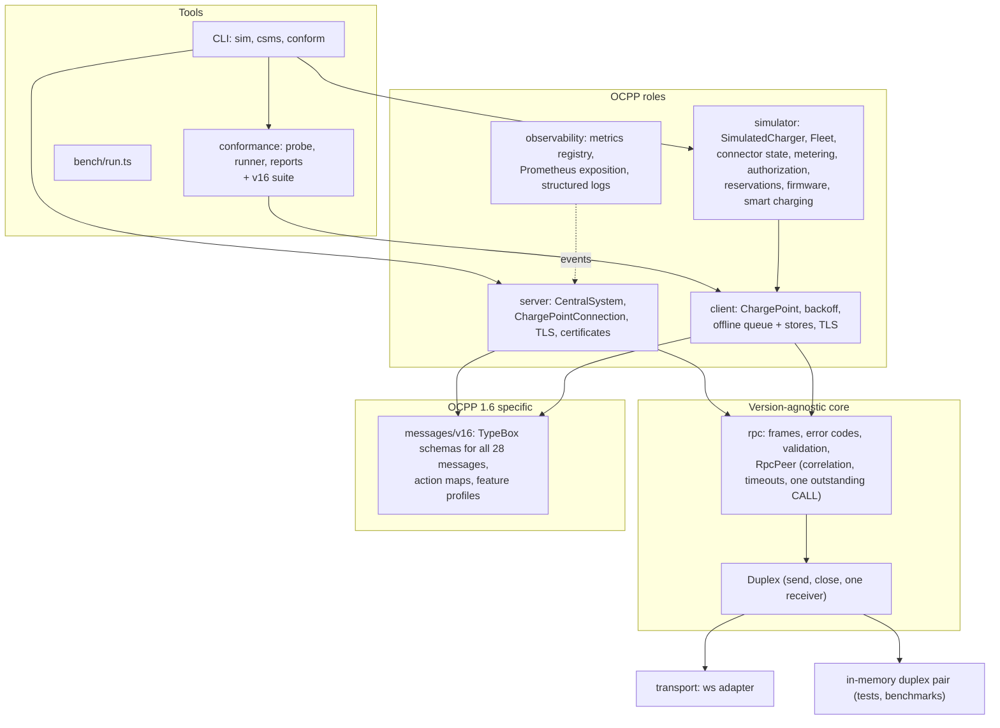
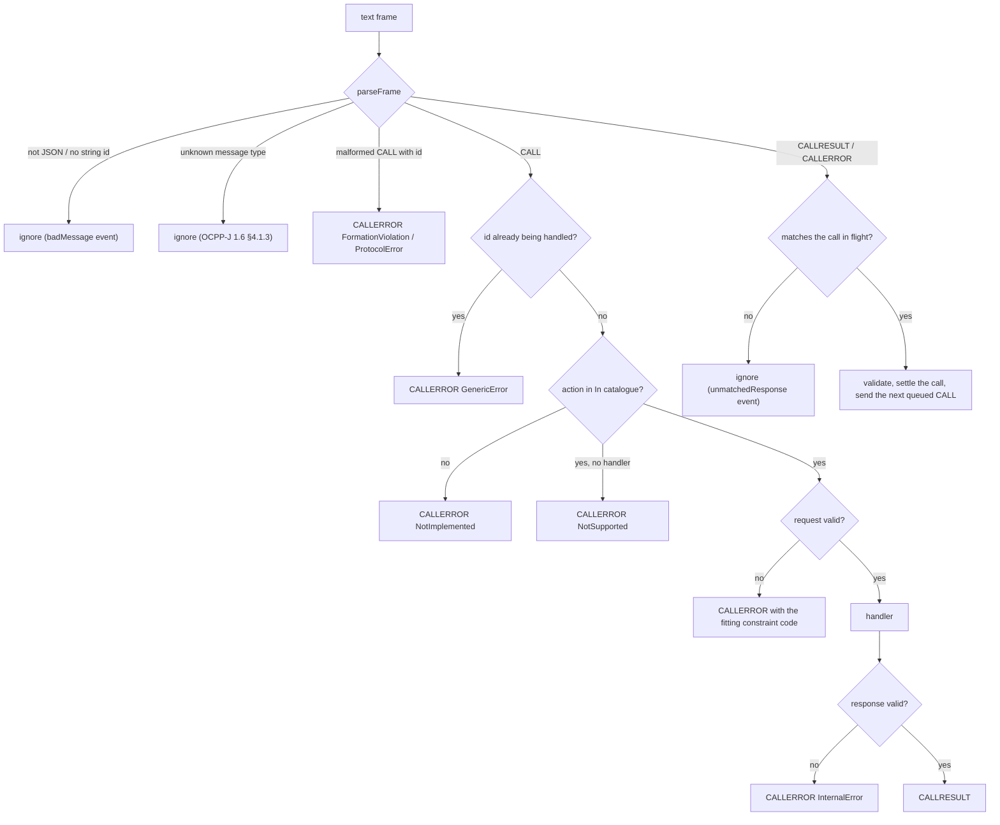
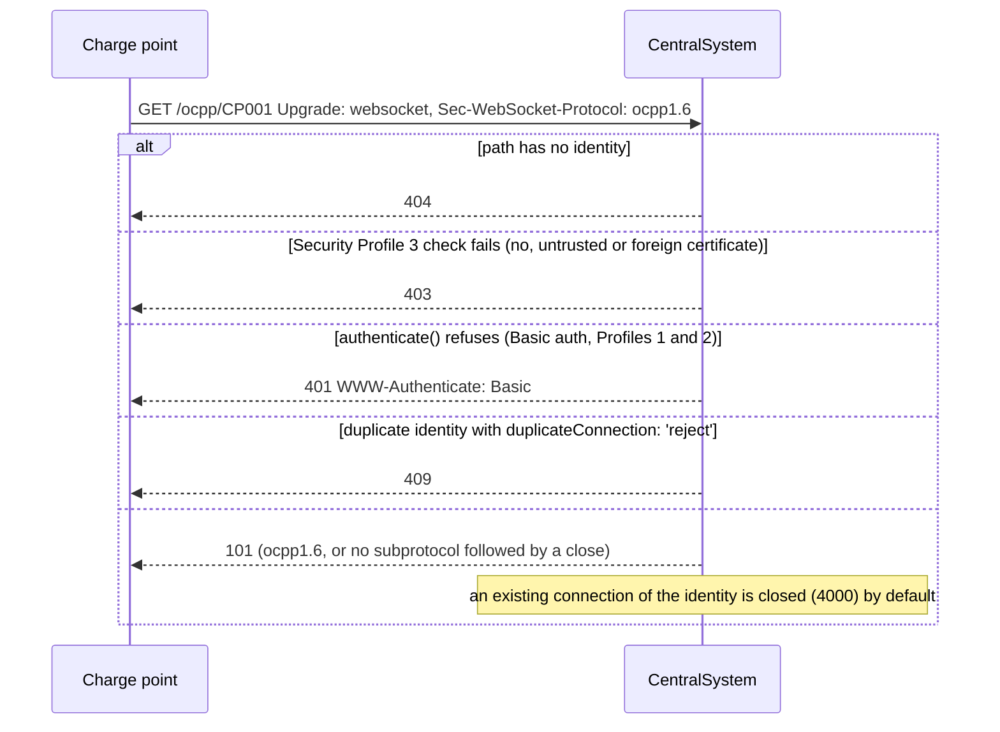
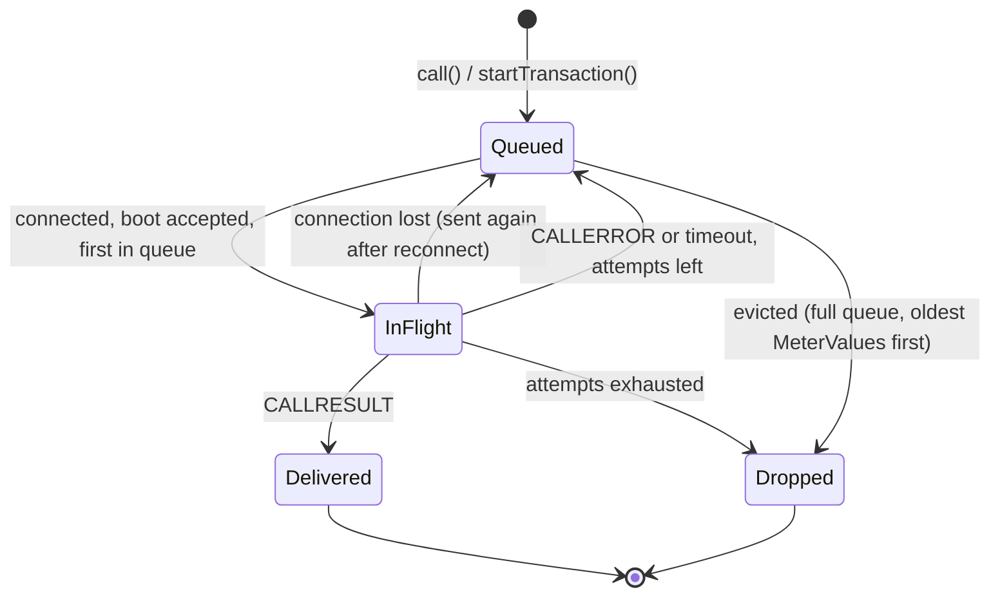

# Architecture

ocpp-kit is layered so that everything protocol-version specific sits in one place and the
RPC core never touches a socket.

## The core: `Duplex` and `RpcPeer`

`RpcPeer<In, Out>` is parameterised by two action catalogues: the actions it receives and
answers (`In`) and the actions it sends (`Out`). A catalogue is a plain object mapping an action
name to a request and a response schema, so the peer itself contains nothing specific to OCPP
1.6: the Central System is `RpcPeer<ChargePointToCentralSystem, CentralSystemToChargePoint>`,
the charge point the other way round. A second protocol version needs a second catalogue, not a
second RPC layer.

The peer talks to a `Duplex`: `send(text)`, `close(code, reason)` and one receiver for messages
and the close event. The `ws` adapter implements it for real sockets, `createDuplexPair()` for
tests and benchmarks.

What happens to an inbound frame:

Outbound calls go through a FIFO queue: the next CALL is only written once the previous one has
been answered, has failed or has timed out (OCPP-J 1.6 §4.1.1). The timeout starts when the
frame is written, not when the call is queued. Property-based tests
(`test/rpc/fuzz.test.ts`) check under random interleavings of calls, answers in any order,
stray frames, aborts and timeouts that there is never more than one CALL outstanding.

## Server

`CentralSystem` owns an HTTP or HTTPS server (or attaches to yours) and handles the WebSocket
upgrade itself, so every refusal is an HTTP answer plus a `rejected` event with a reason:

Each accepted socket becomes a `ChargePointConnection` with its own `RpcPeer`; all connections
share one handler registry. Liveness uses WebSocket pings; a connection that did not answer the
previous ping is terminated.

## Client

`ChargePoint` wraps a connector (the `ws` one by default) with reconnects (exponential backoff
with full jitter, reset only after a stable connection), keep-alive pings, TLS options, and an
offline queue for StartTransaction, MeterValues and StopTransaction:

Messages of a transaction started offline carry a transaction reference instead of an id; the
id is filled in when StartTransaction.conf arrives, and the queue (optionally persisted to a
file) survives restarts. Cached messages are replayed only after an accepted BootNotification
(OCPP 1.6 §4.2).

## Simulator

`SimulatedCharger` is a `ChargePoint` plus models, each in its own module with its own tests:

| Module            | Models                                                                |
| ----------------- | --------------------------------------------------------------------- |
| `connector-state` | the StatusNotification state machine of OCPP 1.6 §4.9, incl. Reserved |
| `configuration`   | the standard configuration keys, read-only flags and value validation |
| `metering`        | sampled and clock-aligned meter values, measurands, phases, units     |
| `authorization`   | Authorization Cache, Local Authorization List, offline rules          |
| `reservations`    | ReserveNow / CancelReservation bookkeeping and expiry                 |
| `firmware`        | UpdateFirmware and GetDiagnostics status sequences, retries, failures |
| `smart-charging`  | profile stacking, purposes, recurring and composite schedules         |
| `ev`              | a CC/CV charging curve and battery model                              |

`Fleet` starts many chargers at a given ramp rate and aggregates their statistics; the
`ocpp-kit sim` command is a thin wrapper around it.

## Conformance checker

The checker reuses nothing from the client on purpose: a probe must be able to send frames a
correct client never would. See [conformance.md](conformance.md).

## Adding a protocol version

1. Add `src/messages/v201/` with the schemas and two action maps.
2. `CentralSystem` and `ChargePoint` currently hard-wire the v16 action maps and
   `OCPP16_SUBPROTOCOL`. That is where a version switch goes: negotiate the subprotocol, then
   create the connection's `RpcPeer` with the matching pair of maps. `RpcPeer`, `parseFrame`
   and validation need no change.
3. Add `src/conformance/v201/` with a `ConformanceSuite` (checks plus a responder); the runner,
   probe and reports are shared.
