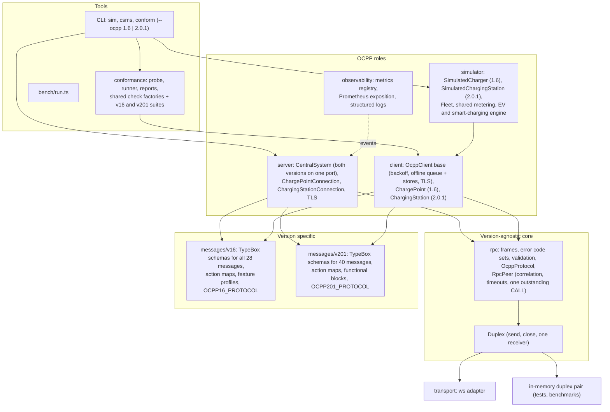
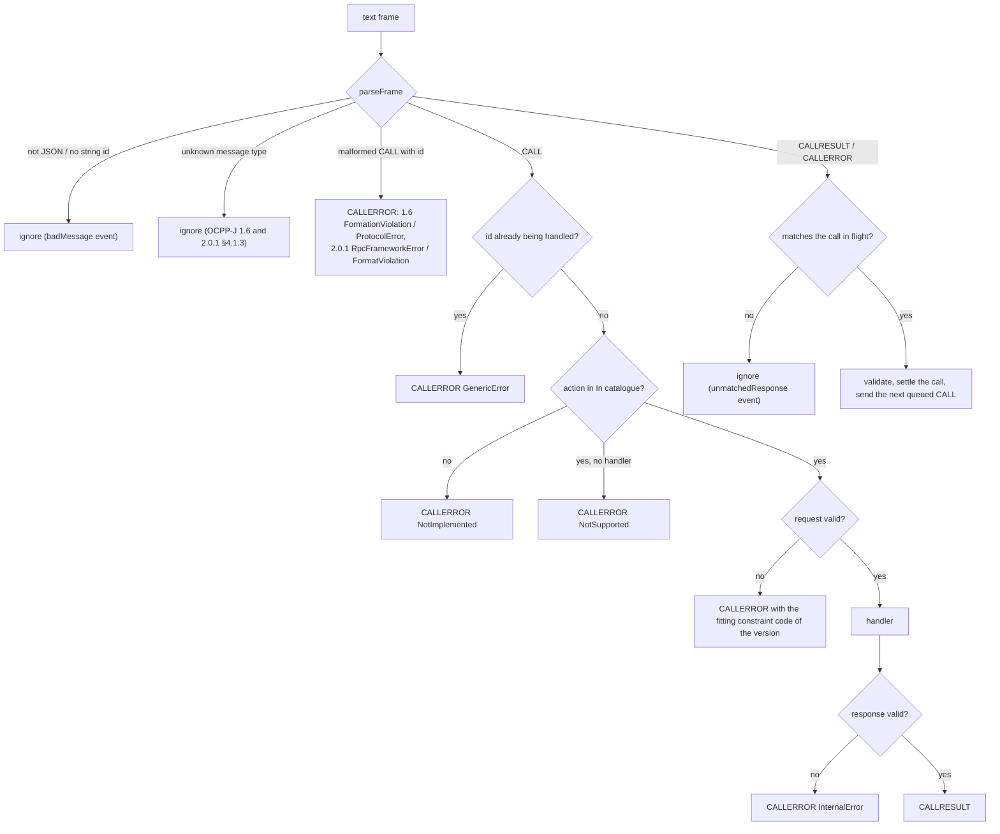
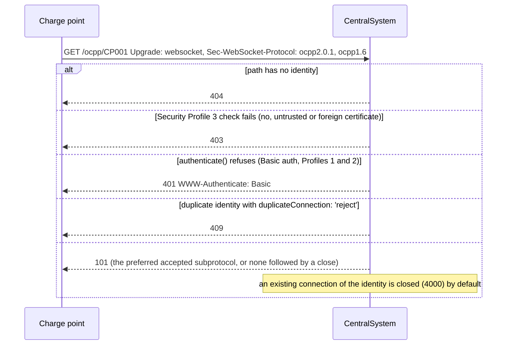
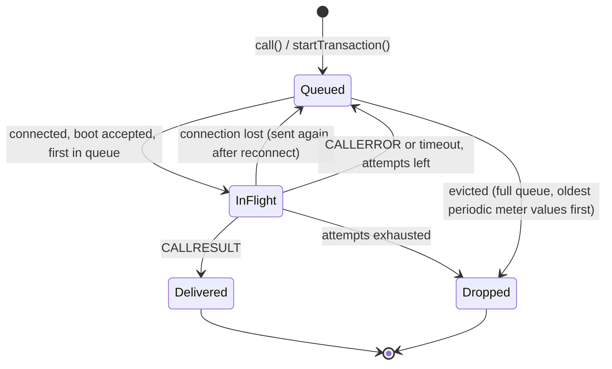

# Architecture

ocpp-kit is layered so that everything protocol-version specific sits in one place and the
RPC core never touches a socket. OCPP 1.6 and OCPP 2.0.1 share the RPC core, the transport, the
server, the client base class, the conformance runner and the observability layer; each
version contributes a message catalogue, a protocol definition, a client class, a simulator
and a conformance suite.

## The core: `Duplex` and `RpcPeer`

`RpcPeer<In, Out>` is parameterised by two action catalogues: the actions it receives and
answers (`In`) and the actions it sends (`Out`). A catalogue is a plain object mapping an action
name to a request and a response schema, so the peer itself contains nothing specific to a
protocol version: a 1.6 Central System is
`RpcPeer<ChargePointToCentralSystem, CentralSystemToChargePoint>`, a 2.0.1 CSMS
`RpcPeer<ChargingStationToCsms, CsmsToChargingStation>`, and the clients the other way round.

The one thing besides the catalogues that differs between versions at this level is the
vocabulary of CALLERROR codes. OCPP-J 1.6 and 2.0.1 define different sets (2.0.1 renames
`FormationViolation` to `FormatViolation`, fixes the spelling of
`OccurrenceConstraintViolation` and adds `RpcFrameworkError` and `MessageTypeNotSupported`), so
`parseFrame`, the validator and the peer take an `ErrorCodeSet` that names the code for each
kind of fault (`format`, `occurrence`, `rpcFramework`, ...). `OCPP16_ERROR_CODES` is the
default; a received code the version does not define becomes `GenericError` with the original
kept in `originalErrorCode`, and a code a handler throws in the other version's spelling is
translated before it is sent.

A version is described by an `OcppProtocol`: its name, WebSocket subprotocol, error code set,
the two catalogues and the transaction-related actions the client must deliver reliably.
`OCPP16_PROTOCOL` and `OCPP201_PROTOCOL` are the two instances; the server, the client base
class and the conformance suites are written against the interface.

The peer talks to a `Duplex`: `send(text)`, `close(code, reason)` and one receiver for messages
and the close event. The `ws` adapter implements it for real sockets, `createDuplexPair()` for
tests and benchmarks.

What happens to an inbound frame:

Outbound calls go through a FIFO queue: the next CALL is only written once the previous one has
been answered, has failed or has timed out (OCPP-J 1.6 §4.1.1; OCPP-J 2.0.1 has the same
rule). The timeout starts when the
frame is written, not when the call is queued. Property-based tests
(`test/rpc/fuzz.test.ts`) check under random interleavings of calls, answers in any order,
stray frames, aborts and timeouts that there is never more than one CALL outstanding.

## Server

`CentralSystem
` owns an HTTP or HTTPS server (or attaches to yours) and handles the
WebSocket upgrade itself, so every refusal is an HTTP answer plus a `rejected` event with a
reason. The type parameter is the set of accepted subprotocols: `new CentralSystem()` is
`CentralSystem<'ocpp1.6'>` and behaves exactly as in 0.2.0, while
`new CentralSystem({ protocols: ['ocpp2.0.1', 'ocpp1.6'] })` serves both versions on one port.
When a client offers several subprotocols, the server picks the first entry of its own
`protocols` list that the client offers.

Each accepted socket becomes a connection of its version, a `ChargePointConnection` (1.6) or a
`ChargingStationConnection` (2.0.1), both subclasses of `OcppConnection`, with its own
`RpcPeer` built from that version's `OcppProtocol`. Handlers are registered per version: on
the server itself for 1.6 (`cs.handle`, `cs.call`, unchanged from 0.2.0) and on `cs.v201` for
2.0.1, each typed with its catalogue; the `connect` and `disconnect` events carry the
connection, whose `version` tells them apart. Liveness uses WebSocket pings; a connection that
did not answer the previous ping is terminated.

## Client

`OcppClient` wraps a connector (the `ws` one by default) with reconnects (exponential backoff
with full jitter, reset only after a stable connection), keep-alive pings, TLS options, and an
offline queue for the transaction-related messages of its protocol. `ChargePoint` (1.6: queues
StartTransaction, MeterValues and StopTransaction) and `ChargingStation` (2.0.1: queues
TransactionEvent) are thin subclasses that supply the protocol, an eviction policy and, for
1.6, the late binding of transaction ids:

In 1.6, messages of a transaction started offline carry a transaction reference instead of an
id; the id is filled in when StartTransaction.conf arrives. In 2.0.1 the station chooses the
transaction id itself, so no late binding is needed; the queue may evict only `Updated` events
that carry nothing but periodic or clock-aligned meter values, which leaves a gap in `seqNo`
that the CSMS can detect. In both versions the queue (optionally persisted to a file) survives
restarts, and queued messages are replayed only after an accepted BootNotification (OCPP 1.6
§4.2; OCPP 2.0.1 B02/B03).

## Simulator

`SimulatedCharger` (1.6) is a `ChargePoint` plus models, each in its own module with its own
tests:

| Module            | Models                                                                |
| ----------------- | --------------------------------------------------------------------- |
| `connector-state` | the StatusNotification state machine of OCPP 1.6 §4.9, incl. Reserved |
| `configuration`   | the standard configuration keys, read-only flags and value validation |
| `metering`        | sampled and clock-aligned meter values, measurands, phases, units     |
| `authorization`   | Authorization Cache, Local Authorization List, offline rules          |
| `reservations`    | ReserveNow / CancelReservation bookkeeping and expiry                 |
| `firmware`        | UpdateFirmware and GetDiagnostics status sequences, retries, failures |
| `smart-charging`  | profile stacking, purposes, recurring and composite schedules         |
| `ev`              | a CC/CV charging curve and battery model                              |

`SimulatedChargingStation` (2.0.1) drives a `ChargingStation` client with the 2.0.1 models, in
`src/simulator/v201/`. It reuses the version-neutral parts (metering, the EV model, the
smart-charging evaluation engine and max-min fair sharing of a station limit between EVSEs)
and adds:

| Module               | Models                                                                                                           |
| -------------------- | ---------------------------------------------------------------------------------------------------------------- |
| `device-model`       | components and variables with Actual/Target/MinSet/MaxSet attributes                                             |
| `standard-variables` | the standard controller variables the station implements, and their values                                       |
| `authorization`      | Authorization Cache, Local Authorization List, idToken and group matching                                        |
| `smart-charging`     | SetChargingProfile acceptance rules (K01), external constraints, reports                                         |
| `firmware`           | UpdateFirmware and GetLog status sequences, retries, failures                                                    |
| `station`            | EVSEs, TransactionEvent (TxStartPoint/TxStopPoint), availability, reservations, remote control, Reset, autopilot |

`Fleet` starts many simulated chargers of either kind (or both) at a given ramp rate and
aggregates their statistics; the `ocpp-kit sim` command is a thin wrapper around it.

## Conformance checker

The checker reuses nothing from the client on purpose: a probe must be able to send frames a
correct client never would. The checks that are the same in both versions (WebSocket, security
profiles, the RPC framework) are factories in `src/conformance/common/`, instantiated by each
suite with its protocol definition and its references. See [conformance.md](conformance.md).

## Adding a protocol version

OCPP 2.1 (or any other version) would follow the path 2.0.1 took:

1. Add `src/messages/v21/` with the schemas, the two action maps and an `OcppProtocol`
   (subprotocol, error code set, transaction actions). If its error codes differ, add an
   `ErrorCodeSet`; `parseFrame`, validation and `RpcPeer` need no change.
2. Add the subprotocol to `OcppSubprotocol`, a connection class and a `VersionEndpoint` on
   `CentralSystem` (as `cs.v201`), and a client subclass of `OcppClient`.
3. Add `src/conformance/v21/` with a `ConformanceSuite`: instantiate the common check
   factories, add the version's own checks and a declining responder. The runner, probe and
   reports are shared.
